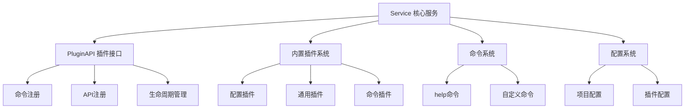

# @alicloud/console-toolkit-core 全局架构分析

## 概述

`@alicloud/console-toolkit-core` 是阿里云控制台工具链的核心库，基于插件化架构设计，为构建和管理前端应用提供了可扩展的工具链基础。该库采用了经典的插件系统设计模式，支持命令注册、API注册、生命周期管理等核心功能。

## 项目结构

```
packages/core/
├── src/
│   ├── index.ts                  # 模块入口文件
│   ├── Service.ts                # 核心服务类
│   ├── PluginAPI.ts             # 插件API接口
│   ├── plugins/                  # 内置插件
│   │   ├── commands/            # 命令插件
│   │   │   └── help.ts          # 帮助命令
│   │   ├── common/              # 通用插件
│   │   │   └── index.ts         # 通用功能
│   │   └── config/              # 配置插件
│   │       ├── config.ts        # 配置管理
│   │       └── options.ts       # 配置选项
│   ├── types/                   # 类型定义
│   │   ├── Command.ts           # 命令类型
│   │   ├── PluginAPI.ts         # 插件API类型
│   │   └── ServiceOption.ts     # 服务选项类型
│   └── utils/                   # 工具函数
│       ├── getPadLength.ts      # 获取填充长度
│       ├── pluginResolver.ts    # 插件解析器
│       └── presetResovler.ts    # 预设解析器
├── test/                        # 测试文件
├── package.json                 # 包配置
├── tsconfig.json               # TypeScript配置
└── tslint.json                 # TSLint配置
```

## 核心架构设计

### 1. 模块导出设计

从 `src/index.ts` 可以看出，该库采用了模块化的导出设计：

```typescript
// 导出插件API
export * from './PluginAPI';
export * from './Service';

// 导出类型定义
export * from './types/Command';
export * from './types/PluginAPI';
export * from './types/ServiceOption';
```

**设计特点：**
- 清晰的分层导出，将核心功能和类型定义分离
- 统一的对外接口，便于使用者集成
- 良好的模块化设计，支持按需导入

### 2. 核心组件关系



### 3. 技术栈和依赖

**核心依赖：**
- `@alicloud/console-toolkit-shared-utils`: 共享工具库
- `package-json`: 包信息处理
- `lodash`: 工具函数库
- `chalk`: 终端着色
- `debug`: 调试工具
- `events`: 事件系统（Node.js内置）

**技术特点：**
- 基于 TypeScript 开发，提供完整的类型支持
- 使用 EventEmitter 实现生命周期管理
- 采用依赖注入的设计模式
- 支持异步插件加载和初始化

## 架构优势

1. **可扩展性**：插件化架构允许轻松添加新功能
2. **模块化**：清晰的模块划分，便于维护和测试
3. **类型安全**：TypeScript提供完整的类型检查
4. **生命周期管理**：基于事件的生命周期系统
5. **配置驱动**：支持灵活的配置管理机制

## 主要特性

1. **插件系统**：支持动态加载和初始化插件
2. **命令注册**：提供命令行工具的注册和执行机制
3. **API注册**：支持同步和异步API的注册和调用
4. **配置管理**：统一的配置读取和管理机制
5. **依赖解析**：自动解析插件依赖关系
6. **生命周期**：完整的插件生命周期管理

## 下一步分析

基于这个全局架构分析，接下来将深入分析：
1. Service 类的详细实现和职责
2. PluginAPI 的接口设计和功能
3. 插件系统的加载和管理机制
4. 命令系统的注册和执行流程
5. 配置系统的实现细节