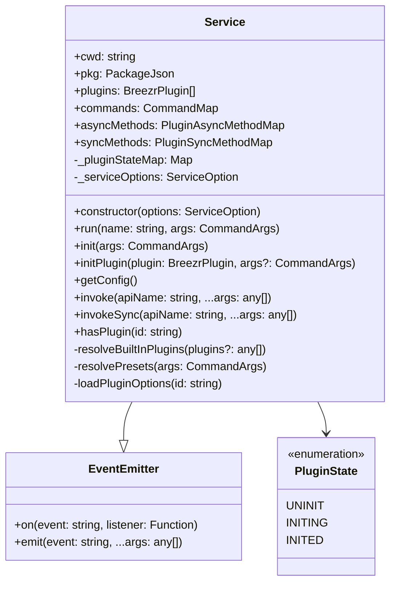
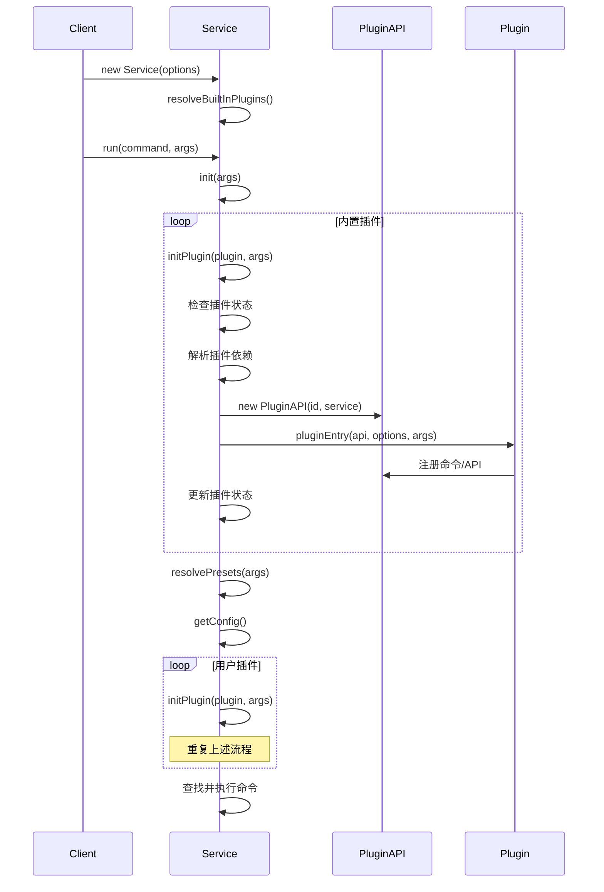

# Service 类架构分析

## 概述

`Service` 类是 `@alicloud/console-toolkit-core` 的核心管理类，继承自 Node.js 的 `EventEmitter`，负责插件管理、命令执行、API调用等核心功能。它采用了经典的服务容器模式，为整个工具链提供了统一的运行时环境。

## 类结构分析

### 1. 类定义和继承关系

```typescript
export class Service extends EventEmitter {
  // 公共只读属性
  public readonly cwd: string;           // 当前工作目录
  public readonly pkg: PackageJson;      // 项目package.json
  public readonly plugins: BreezrPlugin[]; // 插件列表
  public readonly commands: CommandMap;   // 命令映射
  public readonly asyncMethods: PluginAsyncMethodMap; // 异步方法映射
  public readonly syncMethods: PluginSyncMethodMap;   // 同步方法映射

  // 私有属性
  private _pluginStateMap: Map<string, PluginState>; // 插件状态管理
  private _serviceOptions: ServiceOption;            // 服务选项
}
```

### 2. 插件状态管理

```typescript
enum PluginState {
  UNINIT,   // 未初始化
  INITING,  // 初始化中
  INITED    // 已初始化
}
```

**设计意图：**
- 防止插件重复初始化
- 检测循环依赖
- 管理插件生命周期

## 核心功能分析

### 1. 构造函数 - 初始化逻辑

```typescript
public constructor(options: ServiceOption) {
  super();
  this.cwd = options.cwd;
  this._serviceOptions = options;

  // 读取项目package.json
  try {
    this.pkg = require(path.join(this.cwd, 'package.json'));
  } catch (e) {
    console.warn(`no package.json found in cwd: ${this.cwd}`);
    this.pkg = {} as PackageJson;
  }

  // 初始化容器
  this.commands = {};
  this.asyncMethods = {};
  this.syncMethods = {};

  // 解析内置插件
  this.plugins = this.resolveBuiltInPlugins(options.plugins);
  this._pluginStateMap = new Map();
}
```

**特点：**
- 容错处理：package.json 不存在时提供默认值
- 依赖注入：通过 ServiceOption 传入配置
- 内置插件：自动加载核心插件

### 2. 命令执行流程

```typescript
public async run(name: string, args: CommandArgs = {}) {
  await this.init(args);

  let command = this.commands[name];

  if (!command && name) {
    error(`command "${name}" does not exist.`);
    exit(0);
  }

  if (!command || args.help || args.h) {
    command = this.commands.help;
  }
  
  const { fn } = command;
  await fn(args);
}
```

**执行流程：**
1. 初始化所有插件
2. 查找对应命令
3. 错误处理和帮助显示
4. 执行命令函数

### 3. 插件初始化机制

```typescript
public async init(args: CommandArgs) {
  // 初始化内置插件
  for (const plugin of this.plugins) {
    await this.initPlugin(plugin, args);
  }

  // 初始化预设
  await this.resolvePresets(args);

  const config = this.getConfig();
  // 初始化用户定义插件
  for (const plugin of config.plugins) {
    let pluginId = plugin;
    if (isArray(plugin)) {
      [pluginId] = plugin;
    }
    
    // 解析本地插件
    if (pluginId.startsWith('.')) {
      pluginId = path.resolve(this.cwd, pluginId);
    }

    this.plugins.push(pluginId);
    await this.initPlugin(idToPlugin(pluginId), args);
  }
}
```

**初始化顺序：**
1. 内置插件
2. 预设插件
3. 用户配置插件

### 4. 单个插件初始化

```typescript
public async initPlugin(plugin: BreezrPlugin, args?: CommandArgs) {
  const { id, pluginEntry } = plugin;

  // 防止重复初始化
  if (this._pluginStateMap.get(id) === PluginState.INITED) {
    return;
  }

  // 检测循环依赖
  if (this._pluginStateMap.get(id) === PluginState.INITING) {
    error(`can't not circular refer in plugin: ${id}`);
    exit(0);
  }

  this._pluginStateMap.set(id, PluginState.INITING);

  // 解析插件依赖
  try {
    const pkg = require(path.join(id, 'package.json'));
    const depsPlugins = resolvePluginsFromPkg(pkg);

    for (const dep of depsPlugins) {
      await this.initPlugin(dep, args);
    }
  } catch (e) {
    // 忽略依赖解析错误
  }

  // 调用插件入口函数
  await pluginEntry(new PluginAPI(id, this), this.loadPluginOptions(id) || {}, args);

  this._pluginStateMap.set(id, PluginState.INITED);
}
```

**特点：**
- 依赖解析：自动解析和初始化插件依赖
- 状态管理：防止重复初始化和循环依赖
- 错误处理：依赖解析失败时不中断流程

### 5. 内置插件解析

```typescript
private resolveBuiltInPlugins(plugins?: any[]): BreezrPlugin[] {
  const builtInPlugins = [
    './plugins/config/config',    // 配置插件
    './plugins/common/index',     // 通用插件
    './plugins/commands/help'     // 帮助命令
  ].map(idToPlugin);

  if (!plugins) {
    plugins = [];
  }
  const resolvePlugins = plugins.map(idToPlugin);

  return [...builtInPlugins, ...resolvePlugins];
}
```

**内置插件职责：**
- 配置管理
- 通用功能
- 帮助命令

## API调用机制

### 1. 异步API调用

```typescript
public invoke<T>(apiName: string, ...args: any[]): Thenable<T> {
  return this.asyncMethods[apiName](...args);
}
```

### 2. 同步API调用

```typescript
public invokeSync<T>(apiName: string, ...args: any[]): T {
  return this.syncMethods[apiName](...args);
}
```

### 3. 配置获取

```typescript
public getConfig() {
  return this.invokeSync<PluginConfig>('getConfig');
}
```

## 工具函数

### 1. 插件ID转换

```typescript
function idToPlugin(id: string) {
  if (isArray(id)) {
    id = id[0];
  }
  return {
    id: id.replace(/^.\//, 'built-in:'),
    pluginEntry: resolveModule(require(id))
  };
}
```

### 2. 从包依赖解析插件

```typescript
function resolvePluginsFromPkg(pkg: PackageJson) {
  return Object.keys(pkg.dependencies || {})
    .filter(isPlugin)
    .map(idToPlugin);
}
```

## 设计模式分析

### 1. 服务容器模式
- 统一管理所有服务实例
- 提供统一的服务访问接口
- 支持依赖注入

### 2. 插件架构模式
- 核心功能最小化
- 通过插件扩展功能
- 支持插件间通信

### 3. 事件驱动模式
- 继承 EventEmitter
- 支持生命周期事件
- 插件间解耦通信

### 4. 状态管理模式
- 管理插件初始化状态
- 防止重复操作
- 检测循环依赖

## 架构优势

1. **可扩展性**：插件化架构支持功能扩展
2. **可维护性**：清晰的职责分离
3. **容错性**：完善的错误处理机制
4. **性能**：避免重复初始化和循环依赖
5. **灵活性**：支持多种插件加载方式

## 类图



## 时序图 - 插件初始化流程



这个分析展示了 Service 类作为核心管理器的完整架构设计，包括其职责、功能实现和设计模式应用。