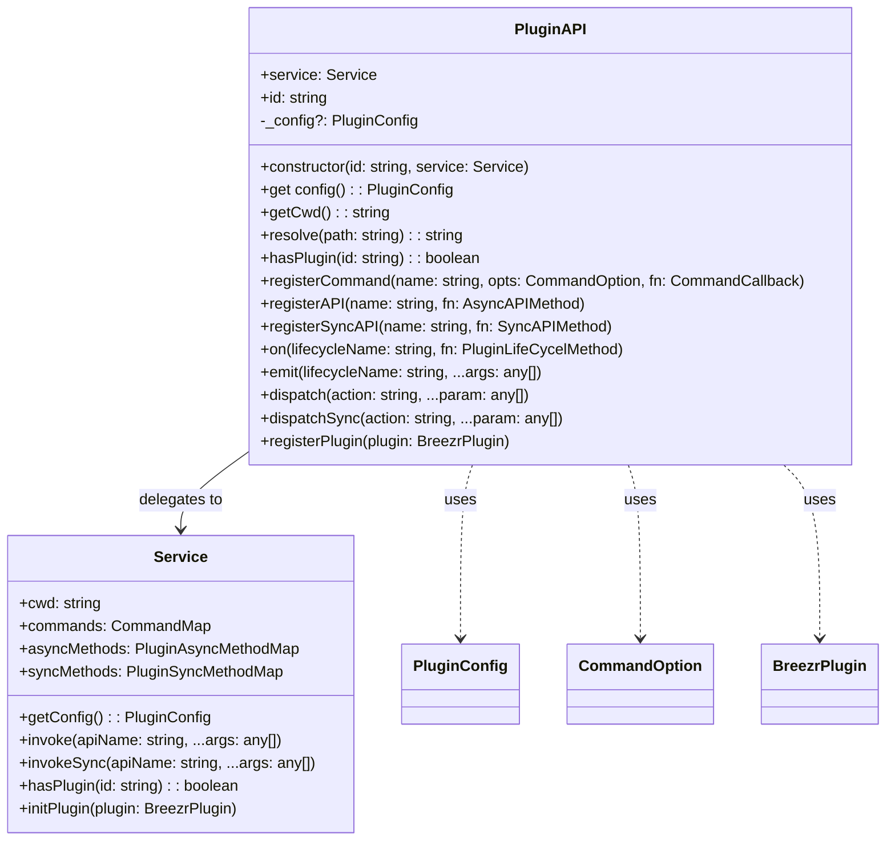
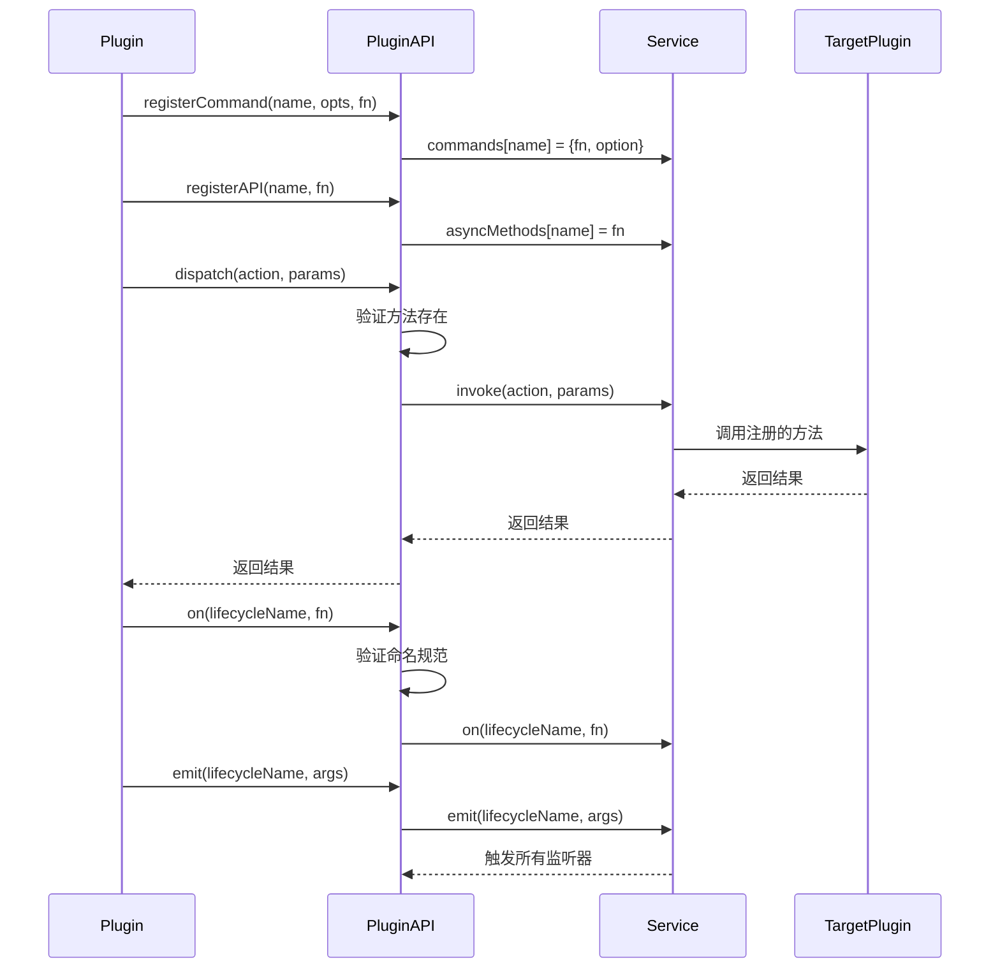

# PluginAPI 架构分析

## 概述

`PluginAPI` 是 `@alicloud/console-toolkit-core` 的插件接口类，为插件提供了与核心系统交互的统一接口。它采用了门面模式（Facade Pattern）设计，封装了 Service 类的复杂性，为插件开发者提供了简洁、易用的API。

## 类结构分析

### 1. 核心属性

```typescript
export class PluginAPI {
  public readonly service: Service;    // 服务实例引用
  public readonly id: string;          // 插件ID
  private _config?: PluginConfig;      // 缓存的配置对象
}
```

### 2. 构造函数

```typescript
public constructor(id: string, service: Service) {
  this.id = id;
  this.service = service;
}
```

**设计特点：**
- 轻量级构造：仅保存必要的引用
- 延迟加载：配置对象按需加载
- 依赖注入：通过构造函数注入服务实例

## 核心功能分析

### 1. 配置管理

```typescript
public get config() {
  if (!this._config) {
    this._config = this.service.getConfig();
  }
  return this._config;
}
```

**特点：**
- 懒加载：首次访问时才加载配置
- 缓存机制：避免重复获取配置
- 透明访问：提供简洁的配置访问接口

### 2. 工作目录和路径管理

```typescript
// 获取当前工作目录
public getCwd() {
  return this.service.cwd;
}

// 解析相对路径为绝对路径
public resolve(_path: string) {
  return path.resolve(this.service.cwd, _path);
}
```

**设计意图：**
- 路径统一：统一管理项目路径
- 便捷性：简化路径操作
- 一致性：确保所有插件使用相同的工作目录

### 3. 插件检测

```typescript
public hasPlugin(id: string) {
  return this.service.hasPlugin(id);
}
```

**用途：**
- 功能检测：检查特定插件是否存在
- 条件加载：根据插件存在情况决定功能
- 避免冲突：防止重复注册相同功能

## 命令系统接口

### 1. 命令注册

```typescript
public registerCommand(
  name: string,
  opts: CommandOption,
  fn: CommandCallback
) {
  this.service.commands[name] = {
    fn,
    option: opts || {}
  };
}
```

**参数说明：**
- `name`: 命令名称
- `opts`: 命令选项（描述、用法、详情等）
- `fn`: 命令处理函数

**CommandOption 结构：**
```typescript
export interface CommandOption {
  description: string;    // 命令描述
  usage: string;         // 使用说明
  details?: string;      // 详细说明
  options?: {            // 命令选项
    [key: string]: string;
  };
}
```

## API注册系统

### 1. 异步API注册

```typescript
public registerAPI(name: string, fn: AsyncAPIMethod) {
  this.service.asyncMethods[name] = fn;
}
```

### 2. 同步API注册

```typescript
public registerSyncAPI(name: string, fn: SyncAPIMethod) {
  if (this.service.syncMethods[name]) {
    error(`method ${name} is duplicate, it will be override`);
  }
  this.service.syncMethods[name] = fn;
}
```

**特点：**
- 重复检测：同步API会检查是否重复注册
- 覆盖警告：重复注册时给出警告
- 类型安全：通过 TypeScript 类型确保接口正确性

## 生命周期管理

### 1. 事件监听

```typescript
public on(lifecycleName: string, fn: PluginLifeCycelMethod) {
  assert(
    lifecycleName.startsWith('on'),
    `Life Cycle method should starts with on`
  );
  this.service.on(lifecycleName, (...args) => {
    fn(...args);
  });
}
```

### 2. 事件发射

```typescript
public emit(lifecycleName: string, ...args: any[]) {
  assert(
    lifecycleName.startsWith('on'),
    `Life Cycle method should starts with on`
  );
  return this.service.emit(lifecycleName, ...args);
}
```

**设计约定：**
- 命名规范：生命周期方法必须以 "on" 开头
- 参数透传：支持任意数量的参数传递
- 断言检查：确保命名规范的遵守

## API调用接口

### 1. 异步API调用 - 多重载

```typescript
// 单参数调用
public dispatch<T extends string, P, R>(action: T, param: P): Thenable<R>;

// 双参数调用
public dispatch<T extends string, P1, P2, R>(
  action: T,
  param1: P1,
  param2: P2
): Thenable<R>;

// 泛型调用
public dispatch<P1, R>(action: string, param1: P1): Thenable<R>;

// 无参数调用
public dispatch<R>(action: string): Thenable<R>;
```

### 2. 异步API调用 - 实现

```typescript
public async dispatch<R = any>(action: string, ...param: any[]) {
  const fn = this.service.asyncMethods[action];
  assert(!!fn, `no method register for name ${action}`);
  return await this.service.invoke<R>(action, ...param);
}
```

### 3. 同步API调用

```typescript
public dispatchSync<R = any>(action: string, ...param: any[]) {
  const fn = this.service.syncMethods[action];
  assert(!!fn, `no method register for name ${action}`);
  return this.service.invokeSync<R>(action, ...param);
}
```

**特点：**
- 方法存在性检查：调用前验证方法是否存在
- 类型安全：通过泛型提供类型推断
- 统一接口：异步和同步调用使用一致的接口设计

## 插件管理

### 1. 插件注册

```typescript
public registerPlugin(plugin: BreezrPlugin) {
  this.service.initPlugin(plugin);
}
```

**用途：**
- 动态加载：运行时动态注册插件
- 依赖管理：插件可以注册其他插件作为依赖
- 扩展性：支持插件的递归加载

## 类型定义分析

### 1. 插件函数类型

```typescript
export type BreezrPluginFn = (
  api: PluginAPI,
  opts?: PluginOptions,
  args?: CommandArgs
) => void;
```

### 2. API方法类型

```typescript
export type AsyncAPIMethod<T = any> = (...args: any) => Thenable<T>;
export type SyncAPIMethod<T = any> = (...args: any) => T;
export type PluginLifeCycelMethod<T = any> = (...args: any) => Thenable<T>;
```

### 3. 插件配置类型

```typescript
export interface PluginConfig {
  plugins: any[];
  presets: any[];
  [key: string]: any;
}
```

## 设计模式分析

### 1. 门面模式（Facade Pattern）
- 隐藏复杂性：封装 Service 类的复杂接口
- 简化使用：提供统一、简洁的插件开发接口
- 解耦合：插件不直接依赖 Service 的实现细节

### 2. 代理模式（Proxy Pattern）
- 访问控制：控制对 Service 实例的访问
- 功能增强：在调用前后添加额外逻辑（如验证、日志）
- 透明性：对插件开发者透明

### 3. 模板方法模式
- 统一流程：定义插件初始化和执行的标准流程
- 扩展点：提供明确的扩展点供插件使用
- 约束规范：通过接口约束插件的行为

## 架构优势

1. **易用性**：简洁的API设计，降低插件开发门槛
2. **类型安全**：完整的 TypeScript 类型定义
3. **功能完整**：涵盖命令、API、生命周期等所有核心功能
4. **扩展性**：支持插件的动态加载和管理
5. **一致性**：统一的接口设计确保插件间的一致性

## 类图



## 时序图 - 插件API调用流程



这个分析全面展示了 PluginAPI 类的设计理念、功能实现和架构价值，说明了它如何为插件开发者提供统一、简洁的接口，同时保持系统的可扩展性和一致性。