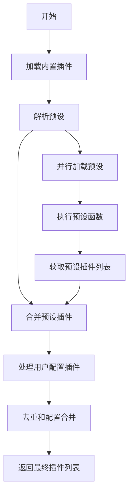
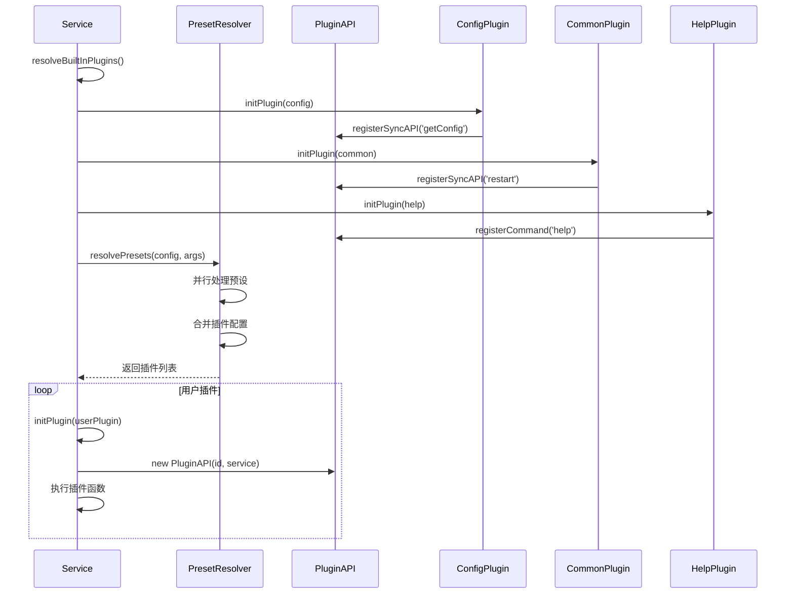
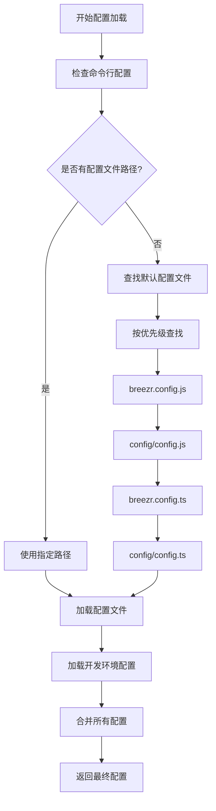

# 插件系统架构分析

## 概述

`@alicloud/console-toolkit-core` 的插件系统是一个高度模块化、可扩展的架构，支持插件的动态加载、依赖管理、配置合并等功能。该系统采用了插件化架构模式，通过预设（presets）和插件（plugins）的组合，实现了灵活的功能扩展机制。

## 核心组件分析

### 1. 插件识别机制

#### pluginResolver.ts - 插件解析器

```typescript
const pluginRE = /^(@breezr\/|breezr-|@[\w-]+\/breezr-)plugin-/;
const scopeRE = /^@[\w-]+\//;

export const isPlugin = (id: string) => pluginRE.test(id);

export const matchesPluginId = (input: string, full: string) => {
  const short = full.replace(pluginRE, '');
  return (
    // input is full
    full === input ||
    // input is short without scope
    short === input ||
    // input is short with scope
    short === input.replace(scopeRE, '')
  );
};
```

**插件命名规范：**
- `@breezr/plugin-xxx`
- `breezr-plugin-xxx`
- `@scope/breezr-plugin-xxx`

**匹配逻辑：**
- 支持完整名称匹配
- 支持简化名称匹配（去掉前缀）
- 支持带作用域的简化名称匹配

### 2. 预设系统

#### presetResolver.ts - 预设解析器

```typescript
function idToPreset(preset: string) {
  let presetId = preset;
  let presetConfig = null;
  if (isArray(preset)) {
    [presetId, presetConfig] = preset;
  }
  return {
    id: presetId.replace(/^.\//, 'built-in:'),
    presetEntry: resolveModule(require(presetId)),
    config: presetConfig || {},
  };
}
```

**预设配置支持：**
- 简单字符串形式：`"preset-name"`
- 数组形式：`["preset-name", { config }]`
- 内置预设：`"./preset-name"`

#### 插件合并机制

```typescript
function mergePluginFromPreset(
  plugin: string,
  pluginMap: Map<string, any>,
  plugins: any[]
) {
  let pluginId = plugin;
  let pluginConfig = null;
  if (isArray(plugin)) {
    [pluginId, pluginConfig] = plugin;
  }
  if (pluginMap.has(pluginId)) {
    // merge plugin config
    if (pluginConfig) {
      Object.assign(pluginMap.get(pluginId), pluginConfig);
    }
  } else {
    plugins.push(plugin);
    pluginMap.set(pluginId, pluginConfig ? pluginConfig : {});
  }
}
```

**合并特点：**
- 避免重复插件：使用 Map 记录已加载的插件
- 配置合并：相同插件的配置会被合并
- 顺序保持：按照预设和配置文件的顺序加载

#### 预设解析流程

```typescript
export async function resolvePresets(config: PluginConfig, args: CommandArgs) {
  const { presets, plugins: orginalPlugin } = config;

  const pluginMap = new Map<string, any>();
  const plugins: any[] = [];

  // 处理预设
  await Promise.all(
    presets.map(idToPreset).map(async preset => {
      const { presetEntry, config } = preset;
      const presetConfig = await (presetEntry(config, args) as PluginConfig);
      presetConfig.plugins.forEach(plugin => {
        mergePluginFromPreset(plugin, pluginMap, plugins);
      });
    })
  );

  // 处理原始插件
  orginalPlugin.forEach(plugin => {
    mergePluginFromPreset(plugin, pluginMap, plugins);
  });

  return plugins;
}
```

**执行顺序：**
1. 并行处理所有预设
2. 合并预设中的插件
3. 处理原始配置中的插件
4. 返回最终的插件列表

## 内置插件分析

### 1. 配置插件 (config/config.ts)

#### 配置文件查找机制

```typescript
const CONFIG_FILES = [
  'breezr.config.js',
  'config/config.js',
  'breezr.config.ts',
  'config/config.ts',
];

export const getConfigFile = (cwd: string) => {
  const files = CONFIG_FILES.map(file => join(cwd, file)).filter(file =>
    existsSync(file),
  );

  if (files.length > 1) {
    warn(
      `Multiple config files ${files.join(', ')} detected, breezr will use ${
        files[0]
      }.`);
  }
  return files[0];
};
```

**配置文件优先级：**
1. `breezr.config.js`
2. `config/config.js`
3. `breezr.config.ts`
4. `config/config.ts`

#### 配置加载和合并

```typescript
export default (api: PluginAPI, opts: PluginOptions, args: CommandArgs) => {
  let config: PluginConfig | null = null;
  const absConfigPath = args.config ? join(api.getCwd(), args.config) : getConfigFile(api.getCwd());

  api.registerSyncAPI('getConfig', () => {
    let devConfig = {};
    if (getEnv().isDev()) {
      try {
        devConfig = require(absConfigPath.replace(/\.js$/, `.local.js`));
      } catch(e) {
        //...
      }
    }

    // 如果用户自己传入了配置, 那么使用传入的配置.
    if (opts.config) {
      config = opts.config;
    }
 
    if (config) {
      return config;
    }

    config = defaultConfig();
    if (absConfigPath) {
      config = Object.assign(
        {},
        config,
        requireFile(absConfigPath),
        devConfig,
      );
    }

    return config;
  });
};
```

**配置合并顺序：**
1. 默认配置
2. 配置文件
3. 开发环境配置 (*.local.js)
4. 命令行传入的配置

### 2. 通用插件 (common/index.ts)

```typescript
export default (api: PluginAPI) => {
  api.registerSyncAPI('restart', () => {
    unwatch();
    if (process.send) {
      process.send({ type: RESTART });
    }
  });
};
```

**功能：**
- 注册 `restart` API
- 支持开发环境的热重启功能

### 3. 帮助命令插件 (commands/help.ts)

```typescript
export default (api: PluginAPI) => {
  function logMainHelp() {
    console.log(
      `\n  Usage: breezr <command> [options]\n` +
      `\n  Commands:\n`
    );
    const commands = api.service.commands;
    const padLength = getPadLength(commands);
    for (const name in commands) {
      if (name !== 'help') {
        const opts = commands[name].option || {};
        console.log(`    ${
          chalk.blue(name.padEnd(padLength))
        }${
          opts.description || ''
        }`);
      }
    }
    console.log(`\n  run ${
      chalk.green(`breezr help [command]`)
    } for usage of a specific command.\n`);
  }

  function logHelpForCommand (name: string, command: Command) {
    if (!command) {
      console.log(chalk.red(`\n  command "${name}" does not exist.`));
    } else {
      const opts = command.option || {};
      if (opts.usage) {
        console.log(`\n  Usage: ${opts.usage}`);
      }
      if (opts.options) {
        console.log(`\n  Options:\n`);
        const padLength = getPadLength(opts.options);
        for (const name in opts.options) {
          console.log(`    ${
            chalk.blue(name.padEnd(padLength))
          }${
            opts.options[name]
          }`);
        }
      }
      if (opts.details) {
        console.log();
        console.log(opts.details.split('\n').map((line: string) => `  ${line}`).join('\n'));
      }
      console.log();
    }
  }

  api.registerCommand('help', {
    description: 'show help for breezr',
    usage: ''
  } ,(args: CommandArgs) => {
    const command = args.commandName;
    if (!command) {
      logMainHelp();
    } else {
      logHelpForCommand(command, api.service.commands[command]);
    }
  });
};
```

**功能：**
- 显示所有可用命令
- 显示特定命令的详细帮助
- 格式化输出，提供良好的用户体验

## 插件加载流程分析

### 1. 插件解析流程



### 2. 插件初始化时序图



### 3. 配置加载流程



## 插件系统特性

### 1. 类型安全

```typescript
export interface PluginConfig {
  plugins: any[];
  presets: any[];
  [key: string]: any;
}

export type BreezrPluginFn = (
  api: PluginAPI,
  opts?: PluginOptions,
  args?: CommandArgs
) => void;

export interface BreezrPlugin {
  id: string;
  opts?: {
    [key: string]: any;
  };
  pluginEntry: BreezrPluginFn;
}
```

### 2. 依赖管理

- 自动解析插件依赖
- 防止循环依赖
- 支持依赖插件的自动加载

### 3. 配置系统

- 支持多种配置文件格式
- 配置合并和覆盖
- 开发环境特殊配置支持

### 4. 错误处理

- 配置文件缺失的容错处理
- 插件加载失败的处理
- 循环依赖检测和报错

## 设计模式分析

### 1. 插件模式（Plugin Pattern）
- 核心功能最小化
- 通过插件扩展功能
- 运行时动态加载

### 2. 工厂模式（Factory Pattern）
- 统一的插件创建接口
- 根据配置动态创建插件实例

### 3. 策略模式（Strategy Pattern）
- 不同的配置加载策略
- 不同的插件匹配策略

### 4. 观察者模式（Observer Pattern）
- 基于事件的生命周期管理
- 插件间的解耦通信

## 架构优势

1. **高可扩展性**：插件化架构支持无限扩展
2. **配置灵活**：支持多种配置方式和环境
3. **依赖管理**：自动处理插件间的依赖关系
4. **错误容错**：完善的错误处理机制
5. **开发友好**：丰富的开发工具和调试支持

## 总结

插件系统是 console-toolkit-core 的核心特性，它通过以下机制实现了高度的可扩展性：

1. **统一的插件规范**：标准化的插件命名和接口
2. **灵活的配置系统**：支持多种配置文件和环境
3. **智能的依赖管理**：自动解析和加载依赖
4. **完善的内置插件**：提供配置、帮助、重启等基础功能
5. **强大的预设系统**：通过预设实现插件的组合和重用

这个插件系统为整个工具链提供了坚实的基础，支持各种复杂的构建和开发场景。