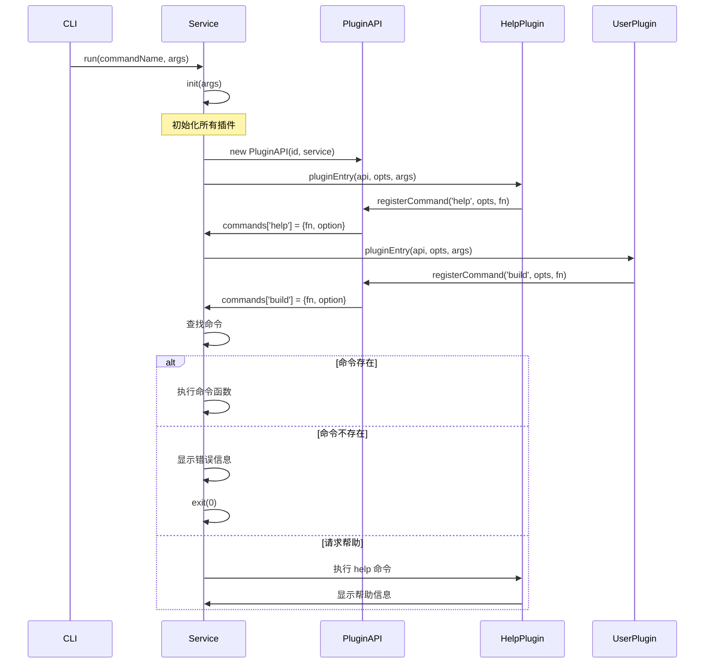

# 命令系统架构分析

## 概述

`@alicloud/console-toolkit-core` 的命令系统是一个基于插件架构的命令行接口实现，通过统一的命令注册、解析和执行机制，为各种工具功能提供了一致的命令行体验。该系统采用了命令模式（Command Pattern）和注册表模式（Registry Pattern），实现了高度的可扩展性和灵活性。

## 核心类型定义

### 1. 命令参数类型

```typescript
/**
 * args defination for CommandCallback
 */
export interface CommandArgs {
  [key: string]: any;
}
```

**特点：**
- 灵活的参数结构
- 支持任意类型的参数值
- 便于命令行参数的动态解析

### 2. 命令回调类型

```typescript
/**
 * Command callback, it will be a command ran by service
 */
export type CommandCallback = (args: CommandArgs, rawArgs?: string[]) => void;
```

**参数说明：**
- `args`: 解析后的命令参数对象
- `rawArgs`: 原始命令行参数数组（可选）

### 3. 命令选项定义

```typescript
/**
 * a defination of a commands 
 */
export interface CommandOption {
  /**
   * description of the commands
   */
  description: string;

  /**
   * indicate the usage of this commands like `Usage: cmd1 [options] <fileName>`
   */
  usage: string;

  /**
   * more detail of the
   */
  details?: string;

  /**
   * options for commands like: -x --xxxx
   */
  options?: {
    [key: string]: string;
  };
}
```

**字段说明：**
- `description`: 命令的简短描述
- `usage`: 命令的使用方法
- `details`: 命令的详细说明（可选）
- `options`: 命令支持的选项及其说明（可选）

### 4. 命令对象

```typescript
/**
 * Command
 */
export interface Command {
  fn: CommandCallback;      // 命令执行函数
  option: CommandOption;    // 命令选项配置
}
```

### 5. 命令映射表

```typescript
export interface CommandMap {
  [key: string]: Command;
}
```

## 命令系统核心流程

### 1. 命令注册流程

#### 在 PluginAPI 中的注册方法

```typescript
/**
 * Register a command in to breezr cli
 *
 * @param {string} name - name of command
 * @param {CommandOption} opts - options for the command
 * @param {CommandCallback} fn handle function for the command
 */
public registerCommand(
  name: string,
  opts: CommandOption,
  fn: CommandCallback
) {
  this.service.commands[name] = {
    fn,
    option: opts || {}
  };
}
```

**注册特点：**
- 简单的键值对存储
- 命令名称作为唯一标识
- 自动提供默认选项

#### 命令注册示例（help 命令）

```typescript
// 来自 plugins/commands/help.ts
api.registerCommand('help', {
  description: 'show help for breezr',
  usage: ''
}, (args: CommandArgs) => {
  const command = args.commandName;
  if (!command) {
    logMainHelp();
  } else {
    logHelpForCommand(command, api.service.commands[command]);
  }
});
```

### 2. 命令执行流程

#### Service.run() 方法分析

```typescript
/**
 *
 * @param name
 * @param args
 * @param rawArv
 */
public async run(
  name: string,
  args: CommandArgs = {}
) {
  await this.init(args);

  let command = this.commands[name];

  if (!command && name) {
    error(`command "${name}" does not exist.`);
    exit(0);
  }

  if (!command || args.help || args.h) {
    command = this.commands.help;
  }
  
  const { fn } = command;
  await fn(args);
}
```

**执行步骤分析：**

1. **初始化阶段**：`await this.init(args)`
   - 加载所有内置插件
   - 解析预设配置
   - 初始化用户配置的插件

2. **命令查找**：`this.commands[name]`
   - 从命令注册表中查找指定命令
   - 支持动态注册的命令

3. **错误处理**：
   ```typescript
   if (!command && name) {
     error(`command "${name}" does not exist.`);
     exit(0);
   }
   ```
   - 检查命令是否存在
   - 提供友好的错误信息

4. **帮助系统**：
   ```typescript
   if (!command || args.help || args.h) {
     command = this.commands.help;
   }
   ```
   - 自动降级到帮助命令
   - 支持 `--help` 和 `-h` 参数

5. **命令执行**：`await fn(args)`
   - 执行命令回调函数
   - 支持异步命令执行

## Help 命令深度分析

### 1. 主帮助显示

```typescript
function logMainHelp() {
  console.log(
    `\n  Usage: breezr <command> [options]\n` +
    `\n  Commands:\n`
  );
  const commands = api.service.commands;
  const padLength = getPadLength(commands);
  for (const name in commands) {
    if (name !== 'help') {
      const opts = commands[name].option || {};
      console.log(`    ${
        chalk.blue(name.padEnd(padLength))
      }${
        opts.description || ''
      }`);
    }
  }
  console.log(`\n  run ${
    chalk.green(`breezr help [command]`)
  } for usage of a specific command.\n`);
}
```

**功能特点：**
- 动态遍历所有注册的命令
- 自动计算命令名称的对齐长度
- 使用 chalk 库进行彩色输出
- 排除 help 命令本身

### 2. 特定命令帮助

```typescript
function logHelpForCommand (name: string, command: Command) {
  if (!command) {
    console.log(chalk.red(`\n  command "${name}" does not exist.`));
  } else {
    const opts = command.option || {};
    if (opts.usage) {
      console.log(`\n  Usage: ${opts.usage}`);
    }
    if (opts.options) {
      console.log(`\n  Options:\n`);
      const padLength = getPadLength(opts.options);
      for (const name in opts.options) {
        console.log(`    ${
          chalk.blue(name.padEnd(padLength))
        }${
          opts.options[name]
        }`);
      }
    }
    if (opts.details) {
      console.log();
      console.log(opts.details.split('\n').map((line: string) => `  ${line}`).join('\n'));
    }
    console.log();
  }
}
```

**显示内容：**
1. 命令使用方法（Usage）
2. 命令选项（Options）
3. 详细说明（Details）
4. 格式化输出和错误处理

### 3. 格式化工具

来自 `@alicloud/console-toolkit-shared-utils` 的 `getPadLength` 函数：

```typescript
// 计算对齐所需的填充长度
const padLength = getPadLength(commands);
```

## 命令系统时序图



## 命令系统设计模式

### 1. 命令模式（Command Pattern）

```typescript
// 命令接口
interface Command {
  fn: CommandCallback;
  option: CommandOption;
}

// 命令调用者
class Service {
  commands: CommandMap;
  
  async run(name: string, args: CommandArgs) {
    const command = this.commands[name];
    await command.fn(args);
  }
}
```

**优势：**
- 将请求封装为对象
- 支持撤销、重做等操作
- 解耦调用者和接收者

### 2. 注册表模式（Registry Pattern）

```typescript
// 命令注册表
export interface CommandMap {
  [key: string]: Command;
}

// 注册和查找
public registerCommand(name: string, opts: CommandOption, fn: CommandCallback) {
  this.service.commands[name] = { fn, option: opts || {} };
}
```

**优势：**
- 动态注册和查找
- 统一的访问接口
- 支持运行时扩展

### 3. 策略模式（Strategy Pattern）

不同的命令代表不同的执行策略：

```typescript
// 帮助策略
const helpStrategy = (args: CommandArgs) => {
  // 显示帮助信息
};

// 构建策略
const buildStrategy = (args: CommandArgs) => {
  // 执行构建逻辑
};
```

## 扩展性分析

### 1. 插件注册命令

任何插件都可以通过 PluginAPI 注册命令：

```typescript
export default (api: PluginAPI) => {
  api.registerCommand('my-command', {
    description: 'My custom command',
    usage: 'breezr my-command [options]',
    details: 'This is a custom command implementation',
    options: {
      '--option1': 'Description for option1',
      '--option2': 'Description for option2'
    }
  }, (args: CommandArgs) => {
    // 命令实现逻辑
    console.log('Executing my-command with args:', args);
  });
};
```

### 2. 命令参数处理

```typescript
// 支持灵活的参数结构
interface CommandArgs {
  [key: string]: any;
}

// 例如：
const args = {
  _: ['file1.js', 'file2.js'],    // 位置参数
  verbose: true,                   // 布尔选项
  output: './dist',               // 字符串选项
  port: 3000,                     // 数字选项
  help: false                     // 帮助标志
};
```

### 3. 错误处理和用户体验

```typescript
// 友好的错误提示
if (!command && name) {
  error(`command "${name}" does not exist.`);
  exit(0);
}

// 自动帮助降级
if (!command || args.help || args.h) {
  command = this.commands.help;
}
```

## 架构优势

1. **统一性**：所有命令使用相同的注册和执行接口
2. **可扩展性**：插件可以轻松注册新命令
3. **一致性**：统一的帮助系统和错误处理
4. **灵活性**：支持复杂的命令参数和选项
5. **用户友好**：完善的帮助系统和错误提示

## 总结

命令系统是 console-toolkit-core 的用户接口层，它通过以下机制提供了优秀的命令行体验：

1. **灵活的命令注册**：插件可以动态注册命令
2. **统一的执行流程**：标准化的命令查找和执行
3. **完善的帮助系统**：自动生成帮助信息
4. **良好的错误处理**：友好的错误提示和降级机制
5. **可扩展的参数系统**：支持复杂的命令行参数

这个命令系统为整个工具链提供了一致、可扩展的命令行接口，是实现各种构建工具和开发工具的重要基础。