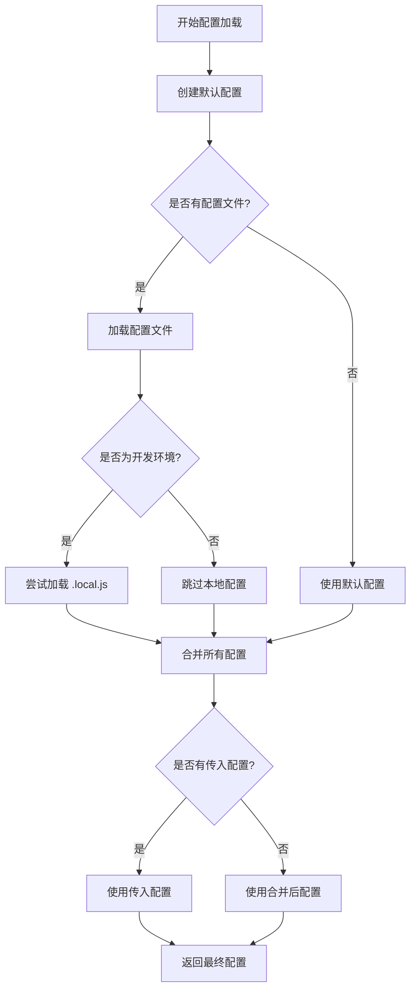

# 配置系统架构分析

## 概述

`@alicloud/console-toolkit-core` 的配置系统是一个多层次、多环境的配置管理机制，支持多种配置文件格式、配置合并、环境特定配置等功能。该系统通过配置插件实现，采用了策略模式和工厂模式，为整个工具链提供了灵活、可扩展的配置管理能力。

## 配置系统核心组件

### 1. 配置类型定义

#### ServiceOption 接口

```typescript
import { PluginConfig } from "./PluginAPI";

export interface ServiceOption {
  /**
   * 当前项目的工作路径
   */
  cwd: string;
  config?: PluginConfig;
  plugins?: any[];
}
```

**字段说明：**
- `cwd`: 项目工作目录
- `config`: 可选的配置对象
- `plugins`: 可选的插件列表

#### PluginConfig 接口

```typescript
export interface PluginConfig {
  plugins: any[];
  presets: any[];
  [key: string]: any;
}
```

**特点：**
- 支持插件列表配置
- 支持预设列表配置
- 支持任意扩展字段

### 2. 默认配置

```typescript
// options.ts
export const defaultConfig = () => ({
  plugins: [],
  presets: []
});
```

**设计理念：**
- 最小化默认配置
- 通过函数返回避免共享引用
- 为扩展提供基础结构

## 配置文件系统

### 1. 支持的配置文件

```typescript
const CONFIG_FILES = [
  'breezr.config.js',
  'config/config.js',
  'breezr.config.ts',
  'config/config.ts',
];
```

**文件优先级：**
1. `breezr.config.js` - 根目录 JS 配置
2. `config/config.js` - 配置目录 JS 配置
3. `breezr.config.ts` - 根目录 TS 配置
4. `config/config.ts` - 配置目录 TS 配置

### 2. 配置文件查找机制

```typescript
export const getConfigFile = (cwd: string) => {
  const files = CONFIG_FILES.map(file => join(cwd, file)).filter(file =>
    existsSync(file),
  );

  debug('core', 'find config file %j', files);

  if (files.length > 1) {
    warn(
      `Multiple config files ${files.join(', ')} detected, breezr will use ${
        files[0]
      }.`);
  }
  return files[0];
};
```

**特点：**
- 按优先级顺序查找
- 支持多个配置文件存在时的警告
- 返回第一个找到的配置文件
- 集成调试日志

### 3. 配置文件加载

```typescript
const requireFile = (filePath: string) => {
  if (!existsSync(filePath)) {
    debug('core', 'can\'t file filePath %s', filePath);
    return {};
  }

  const onError = (e: Error) => {
    console.error(e.stack);
    return {};
  };

  try {
    babelRegister([dirname(filePath)]);
    const config = require(filePath) || {};
    debug('core', 'require filePath %s %j', filePath, config);
    return resolveModule(config);
  } catch (e) {
    return onError(e as Error);
  }
};
```

**加载特点：**
- 文件存在性检查
- Babel 转换支持（支持 ES6+ 语法）
- 模块解析（支持 ES6 模块导出）
- 错误处理和降级
- 详细的调试日志

## 配置管理核心逻辑

### 1. 配置插件主函数

```typescript
export default (api: PluginAPI, opts: PluginOptions, args: CommandArgs) => {
  let config: PluginConfig | null = null;
  const absConfigPath = args.config ? join(api.getCwd(), args.config) : getConfigFile(api.getCwd());

  api.registerSyncAPI('getConfig', () => {
    let devConfig = {};
    if (getEnv().isDev()) {
      try {
        devConfig = require(absConfigPath.replace(/\.js$/, `.local.js`));
      } catch(e) {
        // 忽略本地配置文件不存在的错误
      }
    }

    // 如果用户自己传入了配置, 那么使用传入的配置.
    if (opts.config) {
      config = opts.config;
    }
 
    if (config) {
      return config;
    }

    config = defaultConfig();
    if (absConfigPath) {
      config = Object.assign(
        {},
        config,
        requireFile(absConfigPath),
        devConfig,
      );
    }

    debug('core', 'finish process config, config is: %j', config);

    return config;
  });
};
```

### 2. 配置加载优先级

配置系统按以下优先级加载和合并配置：

1. **默认配置**：`defaultConfig()`
2. **配置文件**：`requireFile(absConfigPath)`
3. **开发环境配置**：`*.local.js`
4. **传入配置**：`opts.config`

### 3. 配置路径解析

```typescript
// 命令行指定配置文件
const absConfigPath = args.config ? 
  join(api.getCwd(), args.config) : 
  getConfigFile(api.getCwd());
```

**支持两种方式：**
- 命令行参数：`--config custom.config.js`
- 自动发现：按优先级查找标准配置文件

## 环境特定配置

### 1. 开发环境配置

```typescript
let devConfig = {};
if (getEnv().isDev()) {
  try {
    devConfig = require(absConfigPath.replace(/\.js$/, `.local.js`));
  } catch(e) {
    // 忽略错误
  }
}
```

**特点：**
- 仅在开发环境加载
- 基于主配置文件名生成（添加 `.local` 后缀）
- 加载失败时静默忽略
- 可用于本地开发特定配置

### 2. 环境检测

通过 `@alicloud/console-toolkit-shared-utils` 的 `getEnv()` 方法：

```typescript
import { getEnv } from '@alicloud/console-toolkit-shared-utils';

if (getEnv().isDev()) {
  // 开发环境逻辑
}
```

## 配置合并策略

### 1. 配置合并代码

```typescript
config = Object.assign(
  {},
  config,                    // 默认配置
  requireFile(absConfigPath), // 配置文件
  devConfig,                 // 开发环境配置
);
```

### 2. 合并流程图



## 配置系统集成

### 1. Service 类中的配置获取

```typescript
// Service.ts
public getConfig() {
  return this.invokeSync<PluginConfig>('getConfig');
}
```

### 2. PluginAPI 中的配置访问

```typescript
// PluginAPI.ts
public get config() {
  if (!this._config) {
    this._config = this.service.getConfig();
  }
  return this._config;
}
```

**特点：**
- 懒加载：首次访问时才加载
- 缓存机制：避免重复加载
- 透明访问：插件无需关心配置来源

## 配置文件示例

### 1. 基础配置文件

```javascript
// breezr.config.js
module.exports = {
  plugins: [
    '@alicloud/console-toolkit-plugin-webpack5',
    '@alicloud/console-toolkit-plugin-react'
  ],
  presets: [
    '@alicloud/console-toolkit-preset-wind-component'
  ],
  // 自定义配置
  outputDir: 'dist',
  publicPath: '/',
  devServer: {
    port: 3000,
    hot: true
  }
};
```

### 2. TypeScript 配置文件

```typescript
// breezr.config.ts
import { PluginConfig } from '@alicloud/console-toolkit-core';

const config: PluginConfig = {
  plugins: [
    ['@alicloud/console-toolkit-plugin-webpack5', {
      // 插件配置
    }]
  ],
  presets: [],
  // 类型安全的配置
  build: {
    target: 'es2015',
    sourcemap: true
  }
};

export default config;
```

### 3. 开发环境配置

```javascript
// breezr.config.local.js
module.exports = {
  devServer: {
    port: 8080,
    proxy: {
      '/api': 'http://localhost:3000'
    }
  },
  // 本地开发特定配置
  debug: true
};
```

## 配置系统的设计模式

### 1. 策略模式（Strategy Pattern）

```typescript
// 不同的配置加载策略
const loadFromFile = (filePath: string) => requireFile(filePath);
const loadFromArgs = (args: CommandArgs) => args.config;
const loadDefault = () => defaultConfig();
```

### 2. 工厂模式（Factory Pattern）

```typescript
// 配置工厂
const createConfig = (options: ConfigOptions) => {
  const config = defaultConfig();
  // 根据选项创建配置
  return config;
};
```

### 3. 单例模式（Singleton Pattern）

```typescript
// 配置缓存
public get config() {
  if (!this._config) {
    this._config = this.service.getConfig();
  }
  return this._config;
}
```

## 调试和监控

### 1. 调试日志

```typescript
debug('core', 'find config file %j', files);
debug('core', 'require filePath %s %j', filePath, config);
debug('core', 'finish process config, config is: %j', config);
```

### 2. 错误处理

```typescript
const onError = (e: Error) => {
  console.error(e.stack);
  return {};
};
```

### 3. 警告提示

```typescript
if (files.length > 1) {
  warn(
    `Multiple config files ${files.join(', ')} detected, breezr will use ${
      files[0]
    }.`);
}
```

## 架构优势

1. **灵活性**：支持多种配置文件格式和位置
2. **可扩展性**：支持任意字段的配置扩展
3. **环境支持**：支持开发环境特定配置
4. **错误容错**：完善的错误处理机制
5. **调试友好**：详细的调试日志和错误信息
6. **性能优化**：配置缓存机制避免重复加载

## 总结

配置系统是 console-toolkit-core 的重要组成部分，它通过以下机制提供了强大的配置管理能力：

1. **多文件支持**：支持 JS/TS 配置文件，多位置查找
2. **分层配置**：默认配置、文件配置、环境配置、传入配置的有序合并
3. **环境感知**：支持开发环境特定配置
4. **错误处理**：完善的错误处理和降级机制
5. **调试支持**：详细的调试日志和警告提示
6. **性能优化**：配置缓存和懒加载机制

这个配置系统为整个工具链提供了统一、灵活的配置管理基础，支持复杂的项目配置需求。