# 组件树结构图

## 概述

本文档展示了 `@alicloud/console-toolkit-core` 的完整组件树结构，包括模块层次、依赖关系、数据流向等，通过多种可视化图表全面展现系统架构。

## 整体组件树结构

### 1. 模块层次结构图

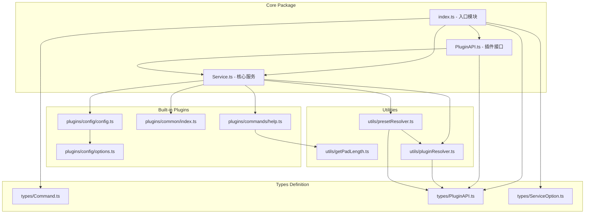

### 2. 详细组件依赖关系

```mermaid
graph LR
    subgraph "External Dependencies"
        EXT1[@alicloud/console-toolkit-shared-utils]
        EXT2[package-json]
        EXT3[lodash]
        EXT4[chalk]
        EXT5[debug]
        EXT6[events.EventEmitter]
    end
    
    subgraph "Core System"
        SERVICE[Service Class]
        PLUGINAPI[PluginAPI Class]
        
        subgraph "Plugin System"
            CONFIG[Config Plugin]
            COMMON[Common Plugin]
            HELP[Help Plugin]
        end
        
        subgraph "Utilities"
            RESOLVER[Plugin Resolver]
            PRESET[Preset Resolver]
            PAD[Pad Length]
        end
    end
    
    SERVICE --> EXT6
    SERVICE --> EXT2
    SERVICE --> EXT3
    SERVICE --> EXT1
    
    PLUGINAPI --> SERVICE
    
    CONFIG --> EXT1
    COMMON --> EXT1
    HELP --> EXT4
    HELP --> PAD
    
    RESOLVER --> PRESET
    PRESET --> EXT3
    PRESET --> EXT1
    
    SERVICE --> CONFIG
    SERVICE --> COMMON
    SERVICE --> HELP
    SERVICE --> RESOLVER
    SERVICE --> PRESET
```

## 类继承和实现关系

### 1. 类图

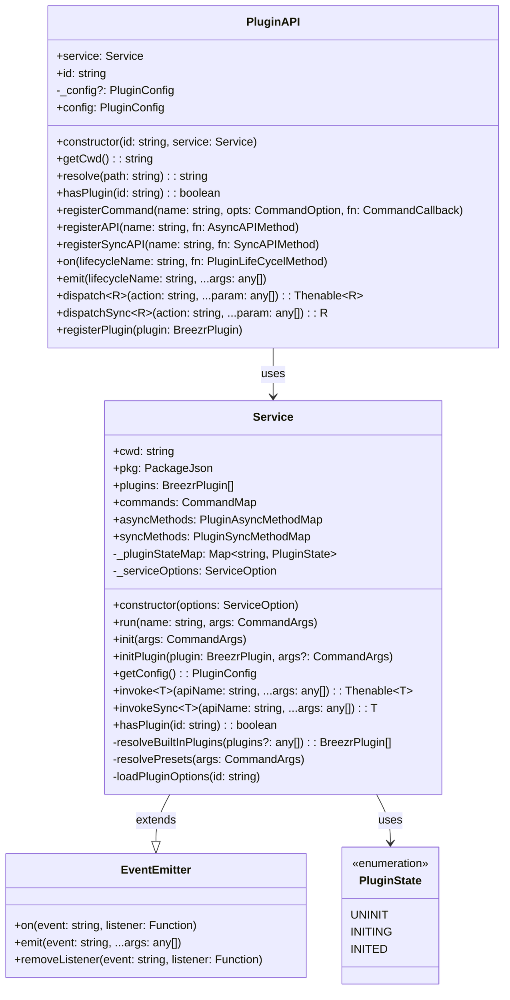

### 2. 接口关系图

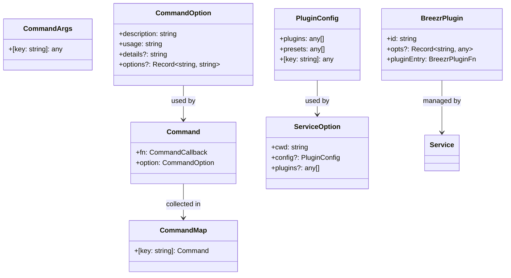

## 插件系统组件树

### 1. 插件生命周期流程

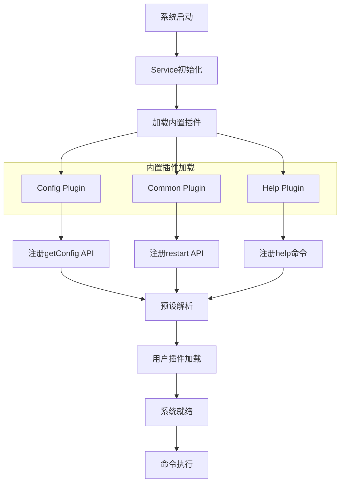

### 2. 插件注册流程

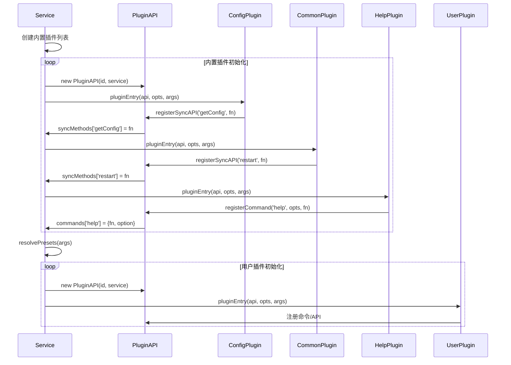

## 配置系统组件树

### 1. 配置加载层次结构

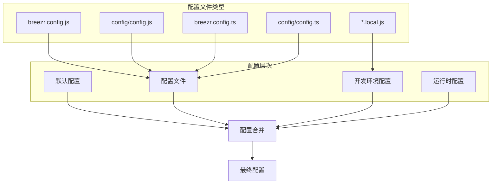

### 2. 配置处理流程

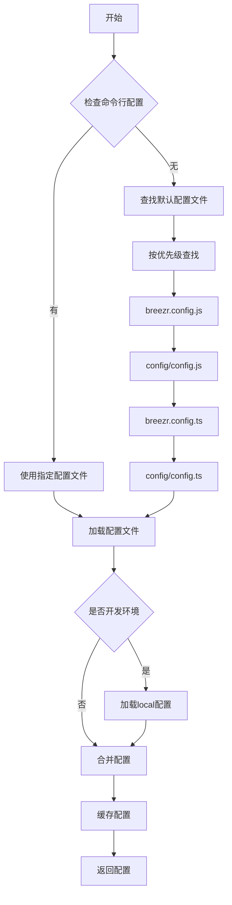

## 命令系统组件树

### 1. 命令注册和执行流程

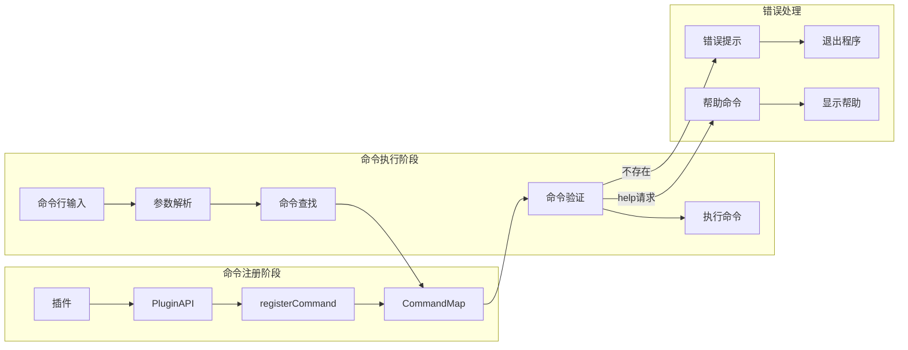

### 2. 帮助系统组件结构

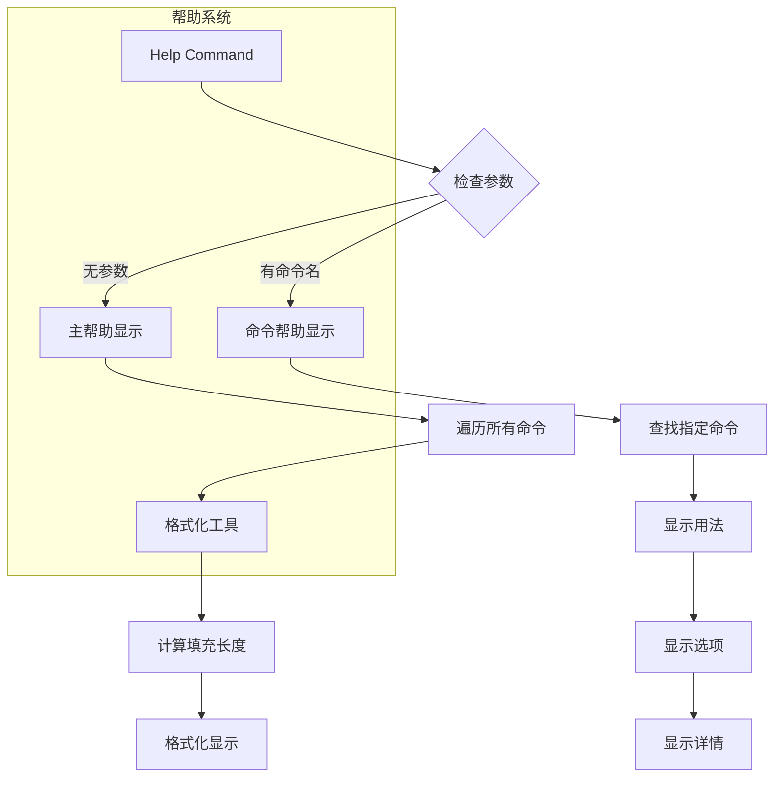

## 工具函数组件关系

### 1. 工具函数依赖图

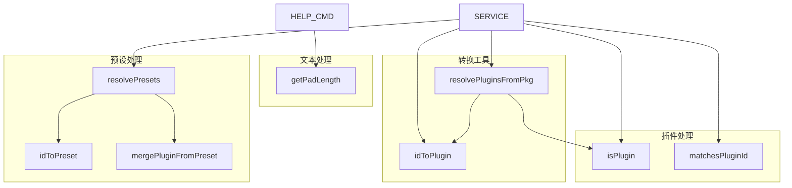

### 2. 函数调用关系

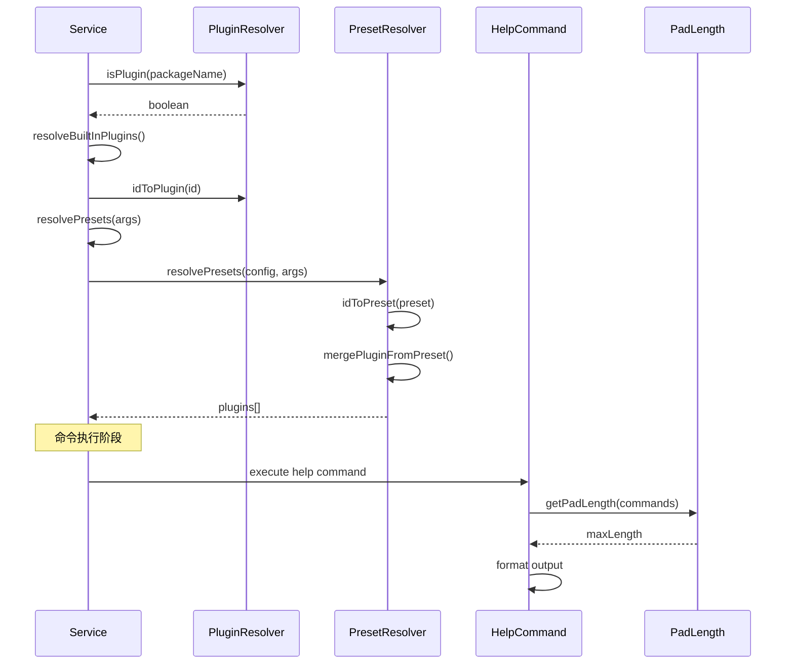

## 数据流向图

### 1. 系统初始化数据流

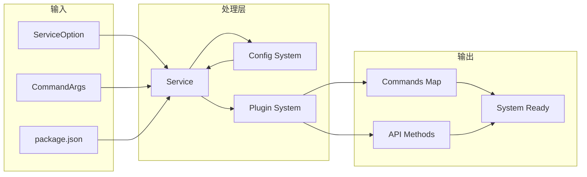

### 2. 运行时数据流

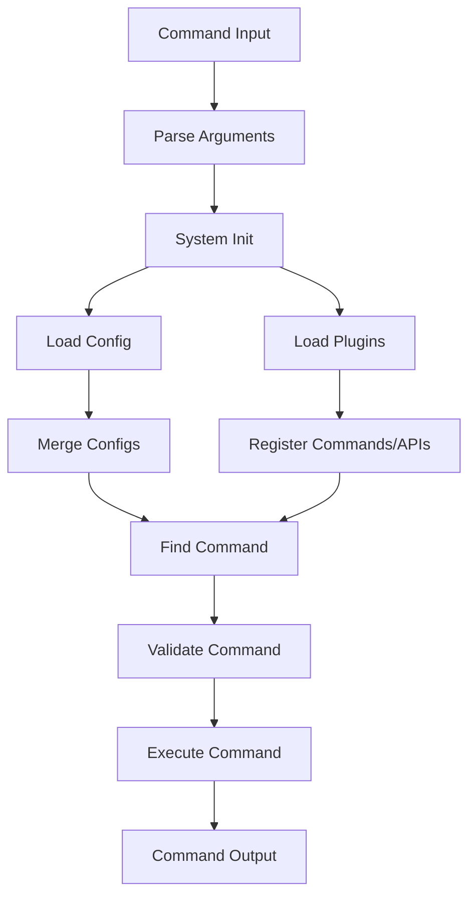

## 总结

通过以上组件树结构图，我们可以清晰地看到：

1. **层次化设计**：系统采用清晰的层次结构，从入口模块到具体实现
2. **模块化架构**：每个组件职责明确，耦合度低
3. **插件化扩展**：核心系统通过插件机制实现功能扩展
4. **配置驱动**：多层次的配置系统支持灵活的项目配置
5. **工具支撑**：丰富的工具函数为核心功能提供支持

这种架构设计保证了系统的可维护性、可扩展性和可测试性，为构建复杂的前端工具链提供了坚实的基础。