# 数据流和函数调用分析

## 概述

本文档深入分析 `@alicloud/console-toolkit-core` 的数据流向和函数调用关系，通过时序图、流程图和调用链分析，全面展现系统的运行机制和数据传递过程。

## 系统启动数据流分析

### 1. 系统初始化完整流程

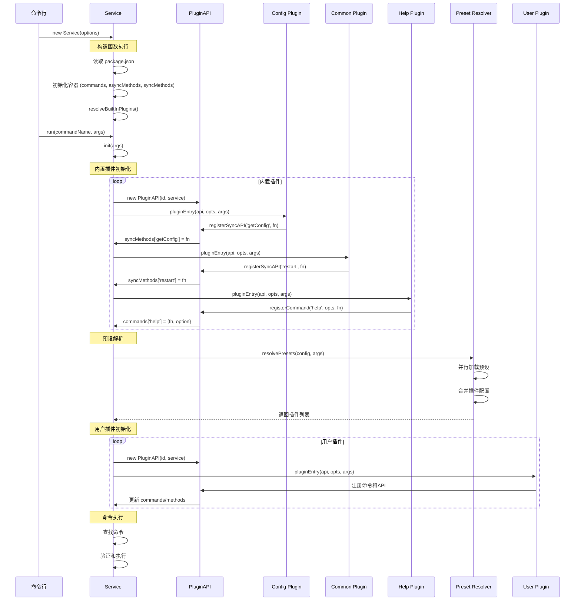

### 2. 配置加载数据流

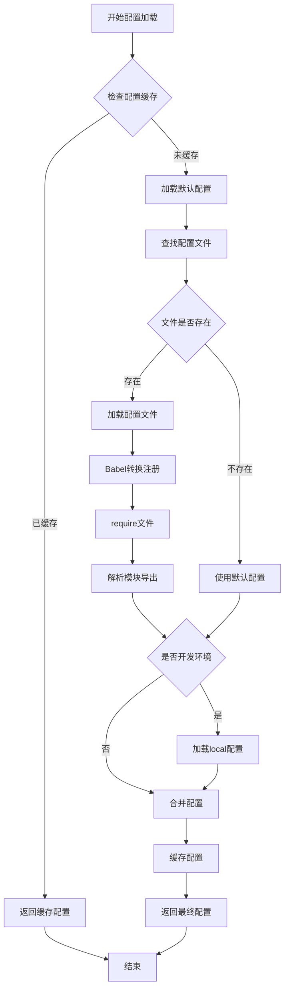

### 3. 数据转换和传递链

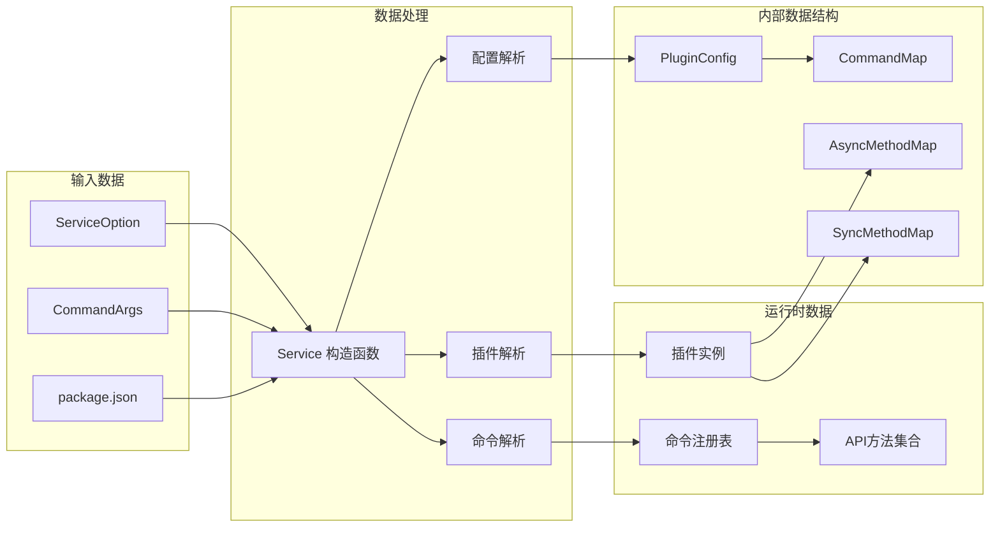

## 核心功能调用链分析

### 1. 命令执行调用链

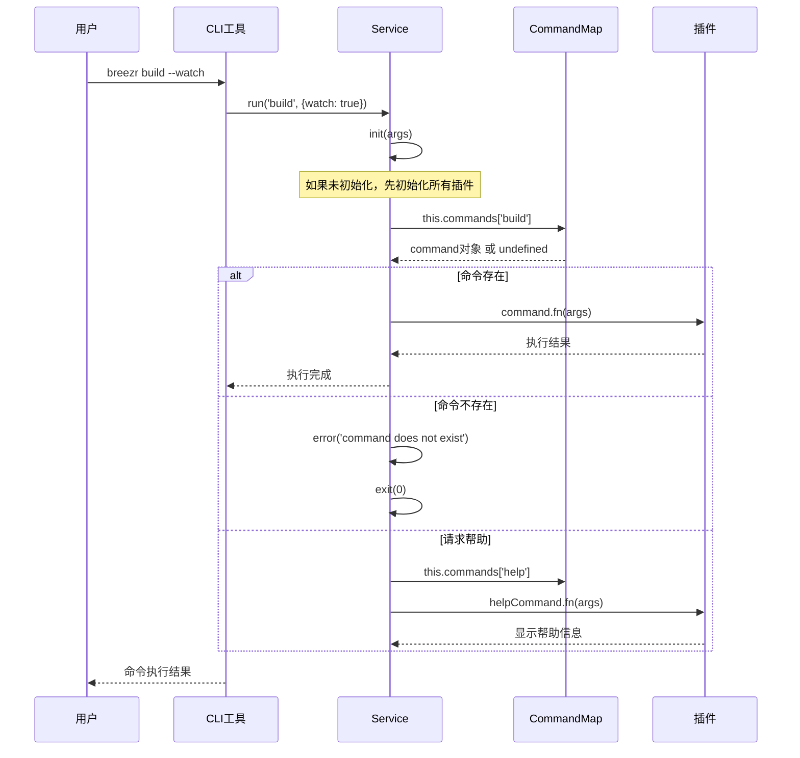

### 2. API调用链分析

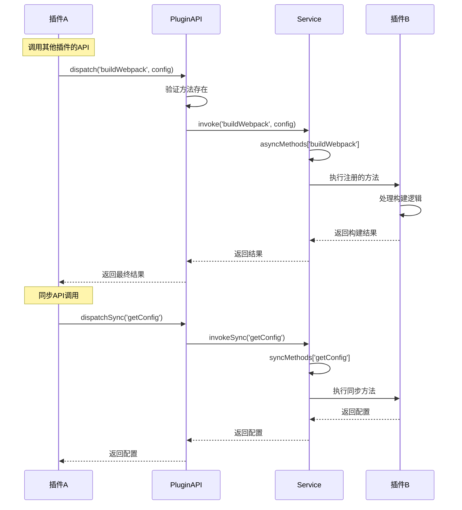

### 3. 生命周期事件调用链

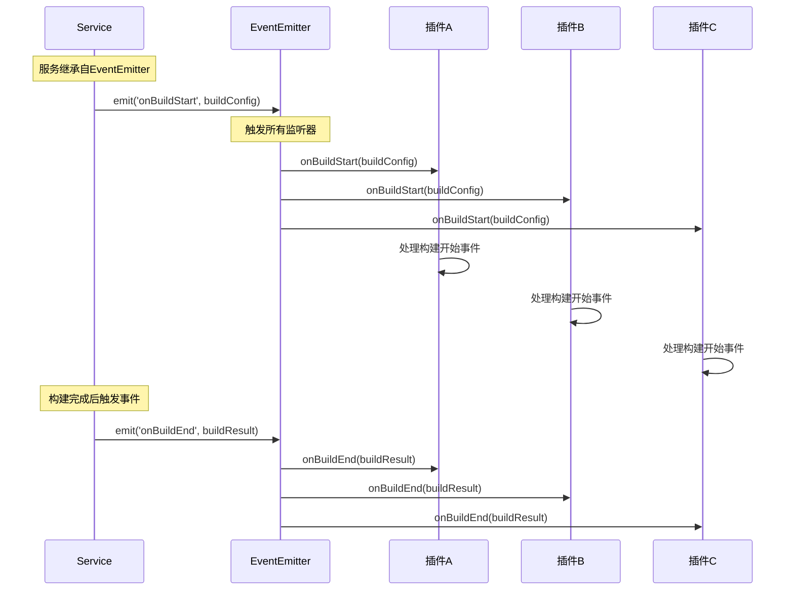

## 插件系统数据流分析

### 1. 插件注册数据流

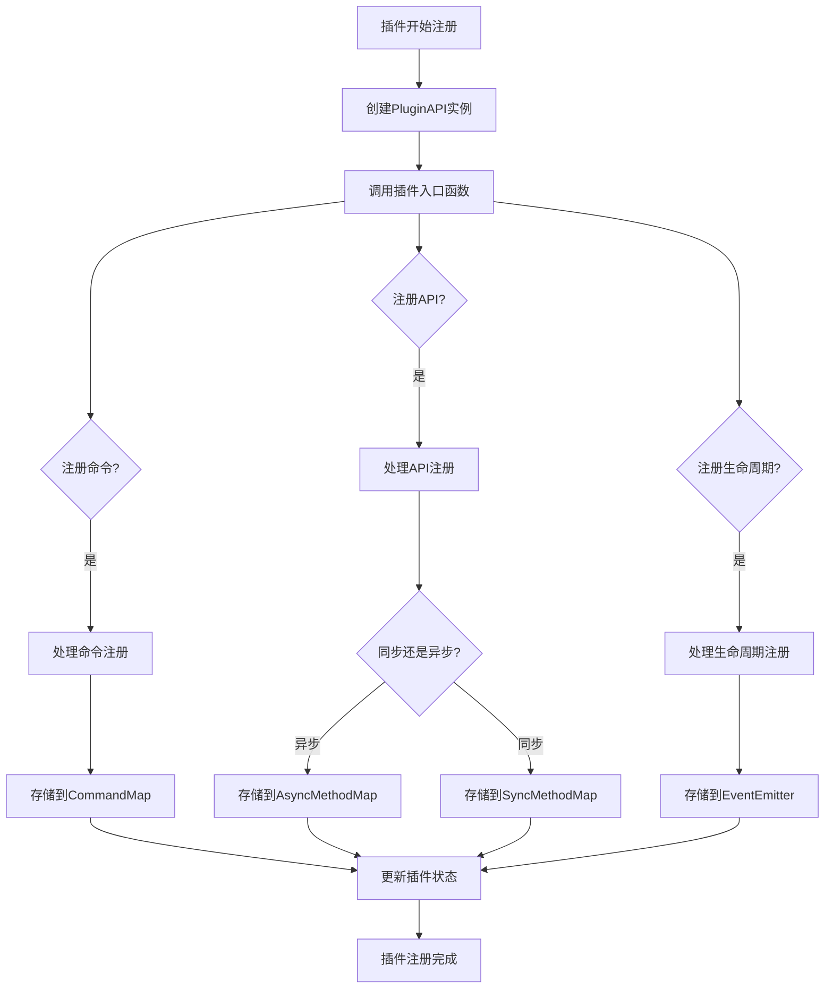

### 2. 预设解析数据流

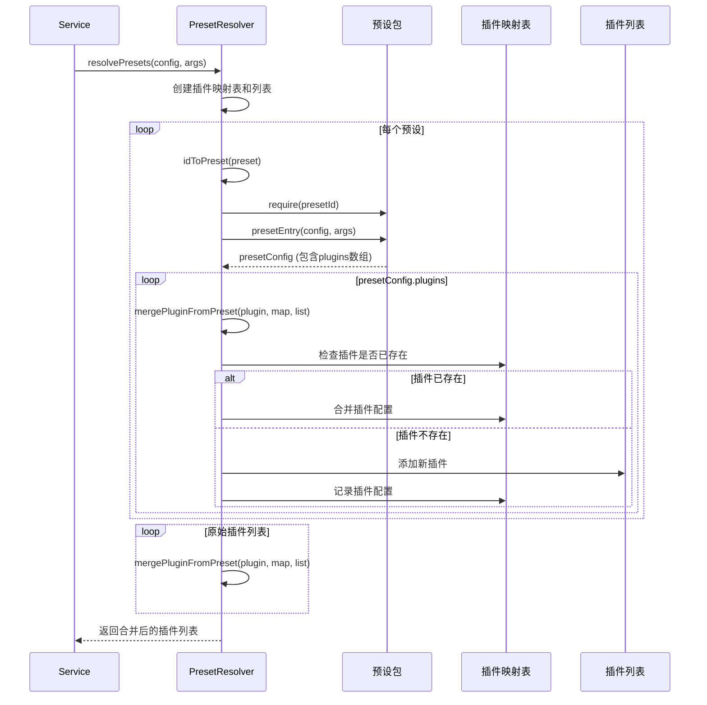

### 3. 配置系统数据流

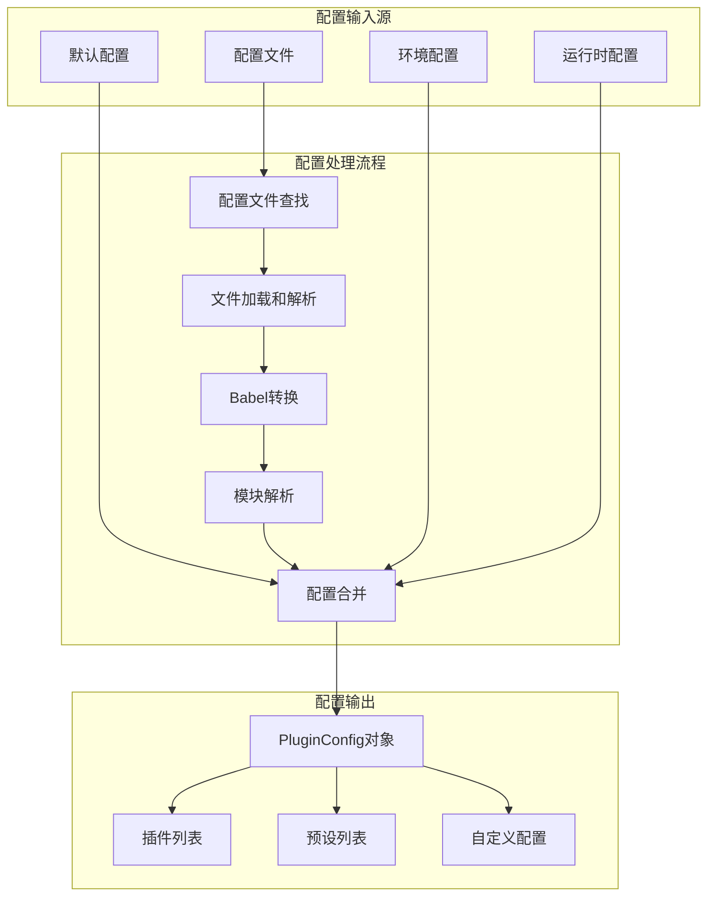

## 函数调用深度分析

### 1. 核心方法调用栈

```typescript
// 调用栈示例：service.run() 方法
Service.run(name, args)
├── Service.init(args)
│   ├── Service.initPlugin(builtinPlugin1, args)
│   │   ├── new PluginAPI(id, service)
│   │   ├── pluginEntry(api, opts, args)
│   │   │   ├── api.registerSyncAPI('getConfig', fn)
│   │   │   └── api.registerCommand('help', opts, fn)
│   │   └── Service._pluginStateMap.set(id, INITED)
│   ├── Service.resolvePresets(args)
│   │   ├── resolvePresets(config, args)
│   │   │   ├── idToPreset(preset)
│   │   │   ├── presetEntry(config, args)
│   │   │   └── mergePluginFromPreset(plugin, map, list)
│   │   └── config.plugins = resolvedPlugins
│   └── Service.initPlugin(userPlugin, args)
├── Service.commands[name] // 查找命令
├── command.fn(args) // 执行命令
└── 返回执行结果
```

### 2. API调用栈分析

```typescript
// 异步API调用栈
PluginAPI.dispatch(action, ...params)
├── Service.asyncMethods[action] // 查找方法
├── assert(!!fn, 'no method register') // 验证方法存在
├── Service.invoke(action, ...params)
│   └── asyncMethods[action](...params) // 执行注册的方法
└── 返回Promise结果

// 同步API调用栈
PluginAPI.dispatchSync(action, ...params)
├── Service.syncMethods[action] // 查找方法
├── assert(!!fn, 'no method register') // 验证方法存在
├── Service.invokeSync(action, ...params)
│   └── syncMethods[action](...params) // 执行注册的方法
└── 返回同步结果
```

### 3. 配置获取调用栈

```typescript
// 配置获取调用栈
PluginAPI.config (getter)
├── this._config ? // 检查缓存
├── this.service.getConfig()
│   └── this.invokeSync('getConfig')
│       └── syncMethods['getConfig']()
│           ├── getConfigFile(cwd) // 查找配置文件
│           ├── requireFile(configPath) // 加载配置文件
│           │   ├── babelRegister([dirname]) // Babel转换
│           │   ├── require(filePath) // 加载模块
│           │   └── resolveModule(config) // 解析ES6模块
│           ├── Object.assign({}, default, file, dev) // 合并配置
│           └── 返回最终配置
└── this._config = config // 缓存配置
```

## 错误处理和异常流

### 1. 错误处理调用链

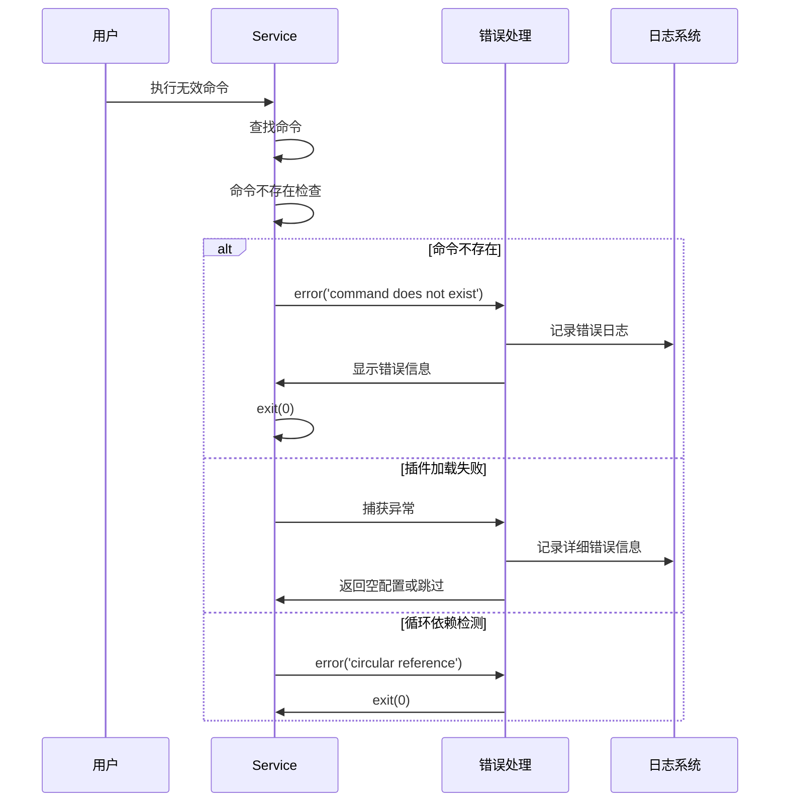

### 2. 配置加载异常处理

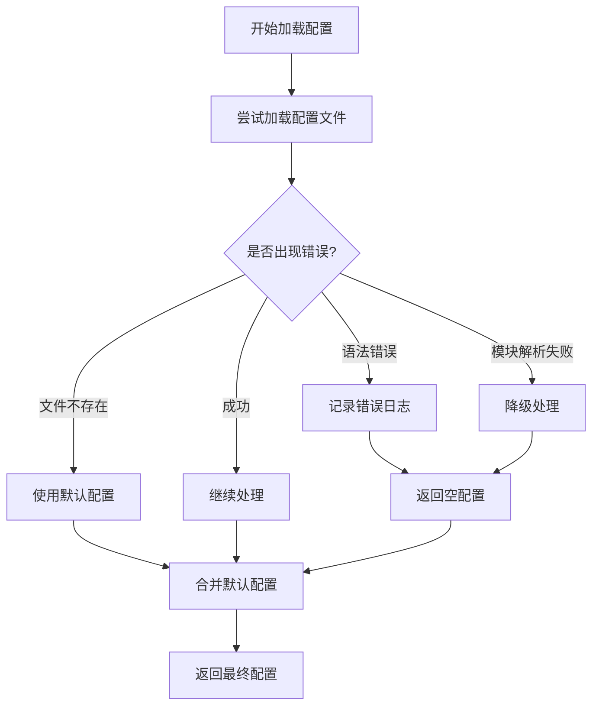

## 性能优化数据流

### 1. 缓存机制调用分析

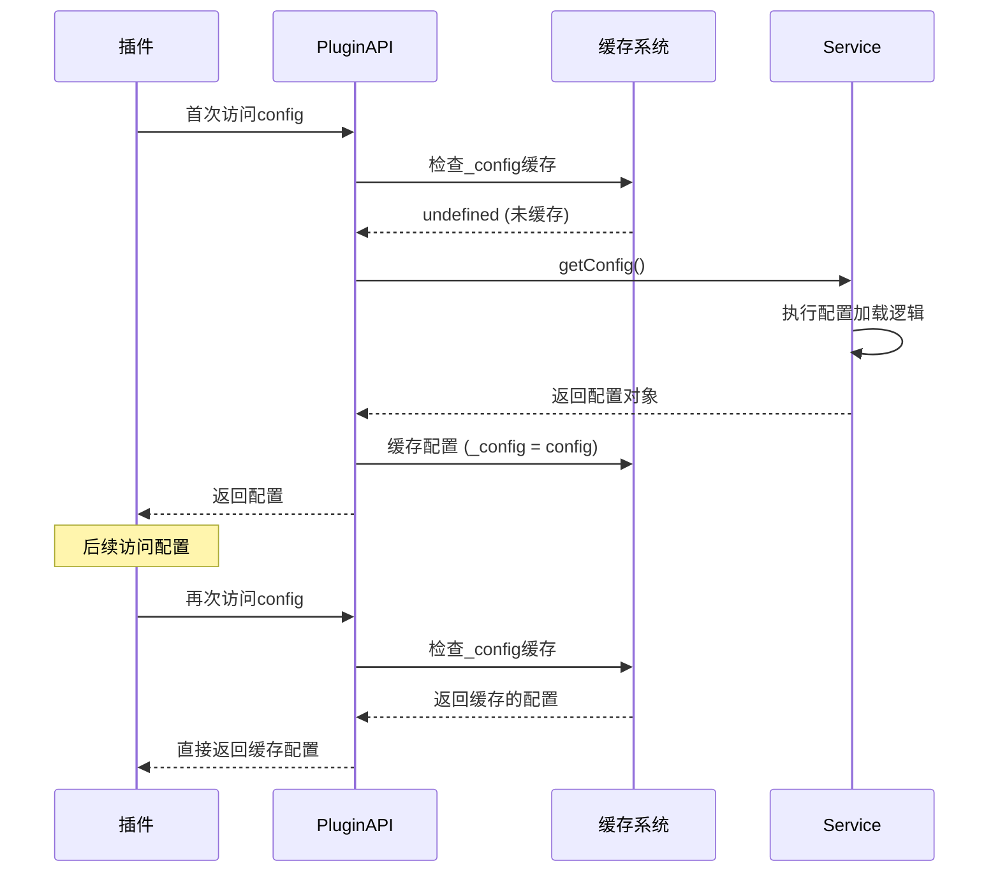

### 2. 并行处理数据流

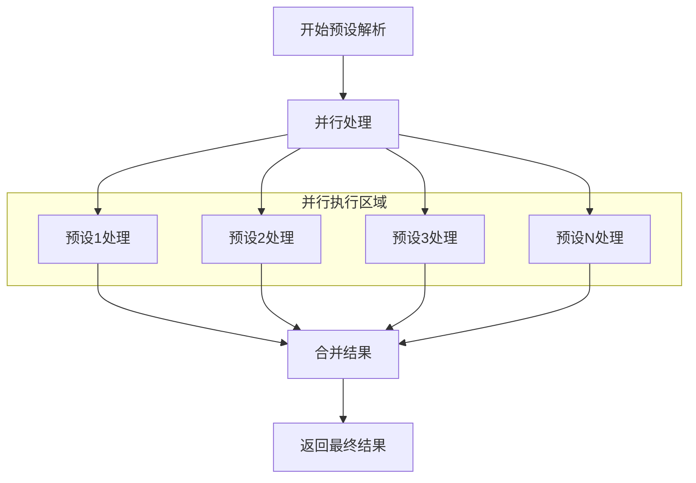

## 总结

通过对数据流和函数调用关系的深入分析，我们可以看到：

### 数据流特点
1. **单向数据流**：从配置到插件，从插件到命令执行
2. **分层处理**：配置层 → 插件层 → 命令层 → 执行层
3. **缓存优化**：关键数据进行缓存，避免重复计算
4. **异步处理**：支持异步插件加载和API调用

### 函数调用特点
1. **层次化调用**：明确的调用层次和职责分离
2. **错误传播**：完善的错误处理和异常传播机制
3. **事件驱动**：基于EventEmitter的生命周期管理
4. **插件解耦**：通过PluginAPI实现插件间的解耦通信

### 性能优化策略
1. **配置缓存**：避免重复的配置文件读取和解析
2. **并行加载**：预设和插件的并行初始化
3. **懒加载**：按需加载配置和模块
4. **状态管理**：防止重复初始化和循环依赖

这种设计确保了系统的高性能、高可用性和良好的用户体验。