# 架构图和可视化分析

## 概述

本文档提供了 `@alicloud/console-toolkit-core` 的全面架构图和可视化分析，通过多种图表形式展现系统的整体架构、模块关系、数据流向和交互模式，为理解和维护系统提供直观的视觉指南。

## 整体系统架构图

### 1. 系统宏观架构

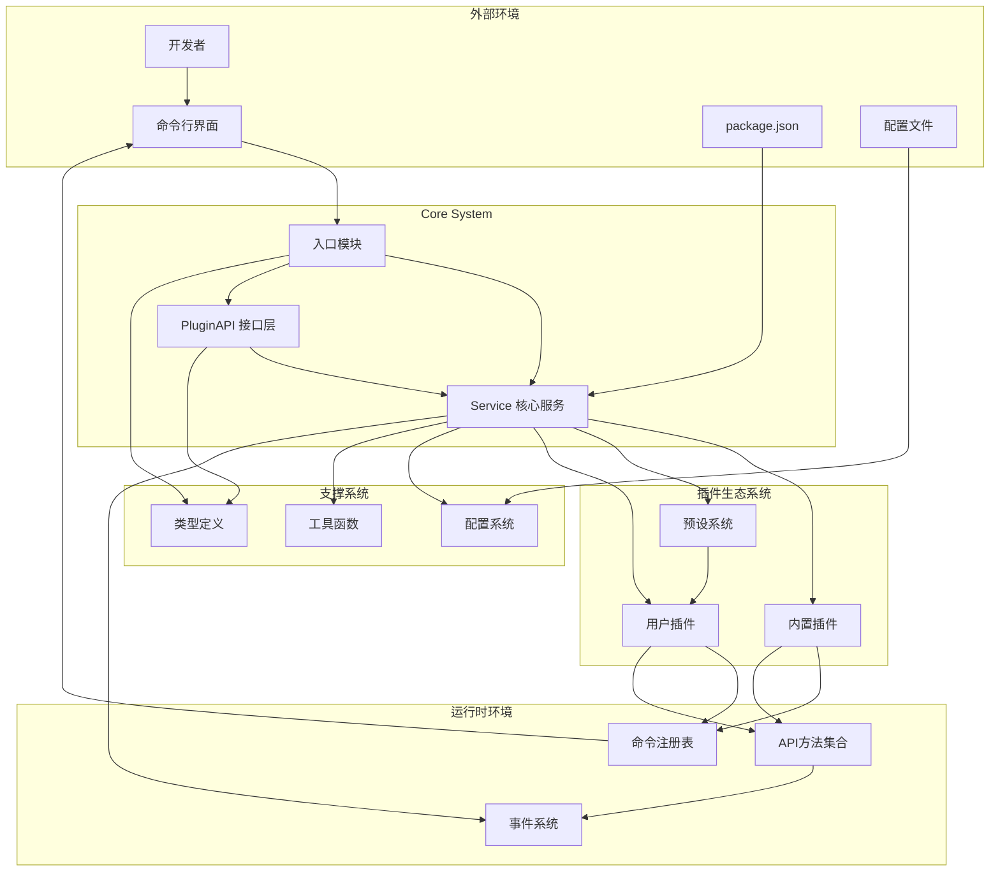

### 2. 核心模块依赖图

```mermaid
graph LR
    subgraph "External Dependencies"
        EXT1[@alicloud/console-toolkit-shared-utils]
        EXT2[package-json]
        EXT3[lodash]
        EXT4[chalk]
        EXT5[debug]
        EXT6[assert]
        EXT7[path]
        EXT8[fs]
        EXT9[events]
    end
    
    subgraph "Core Modules"
        INDEX[index.ts]
        SERVICE[Service.ts]
        PLUGINAPI[PluginAPI.ts]
        
        subgraph "Types"
            T1[Command.ts]
            T2[PluginAPI.ts]
            T3[ServiceOption.ts]
        end
        
        subgraph "Utils"
            U1[getPadLength.ts]
            U2[pluginResolver.ts]
            U3[presetResolver.ts]
        end
        
        subgraph "Plugins"
            P1[config/config.ts]
            P2[config/options.ts]
            P3[common/index.ts]
            P4[commands/help.ts]
        end
    end
    
    INDEX --> SERVICE
    INDEX --> PLUGINAPI
    INDEX --> T1
    INDEX --> T2
    INDEX --> T3
    
    SERVICE --> EXT1
    SERVICE --> EXT2
    SERVICE --> EXT3
    SERVICE --> EXT7
    SERVICE --> EXT9
    SERVICE --> T1
    SERVICE --> T2
    SERVICE --> T3
    SERVICE --> U2
    SERVICE --> U3
    SERVICE --> PLUGINAPI
    
    PLUGINAPI --> EXT6
    PLUGINAPI --> EXT7
    PLUGINAPI --> SERVICE
    PLUGINAPI --> T1
    PLUGINAPI --> T2
    
    U3 --> EXT3
    U3 --> EXT1
    U3 --> T2
    U3 --> U2
    
    P1 --> EXT1
    P1 --> EXT7
    P1 --> EXT8
    P1 --> PLUGINAPI
    P1 --> T2
    P1 --> T1
    P1 --> P2
    
    P3 --> EXT1
    P3 --> PLUGINAPI
    
    P4 --> EXT4
    P4 --> EXT1
    P4 --> PLUGINAPI
    P4 --> T1
    P4 --> U1
```

## 分层架构图

### 1. 经典三层架构

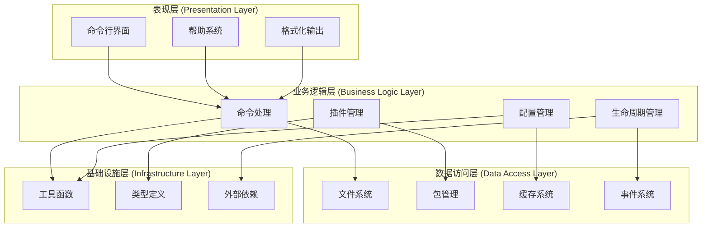

### 2. 六边形架构 (端口适配器模式)

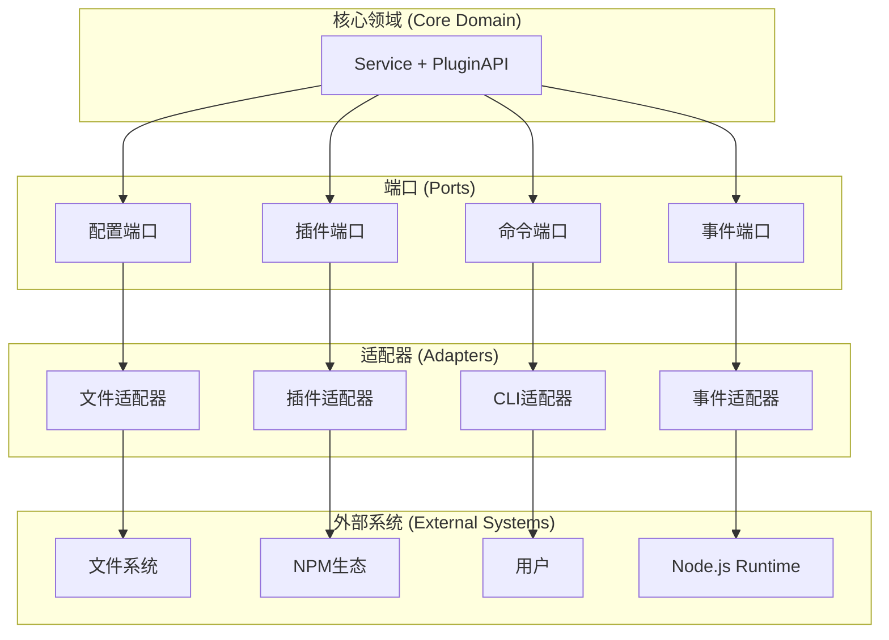

## 插件架构可视化

### 1. 插件生态系统架构

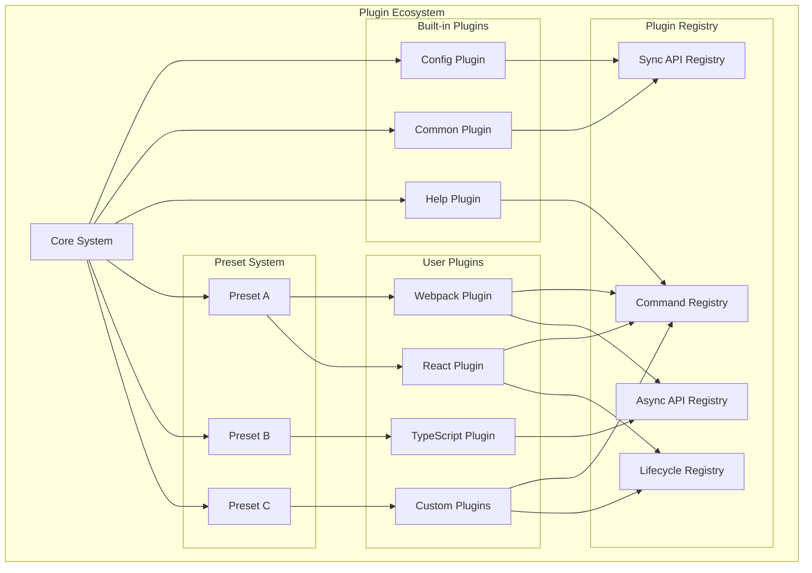

### 2. 插件通信模式

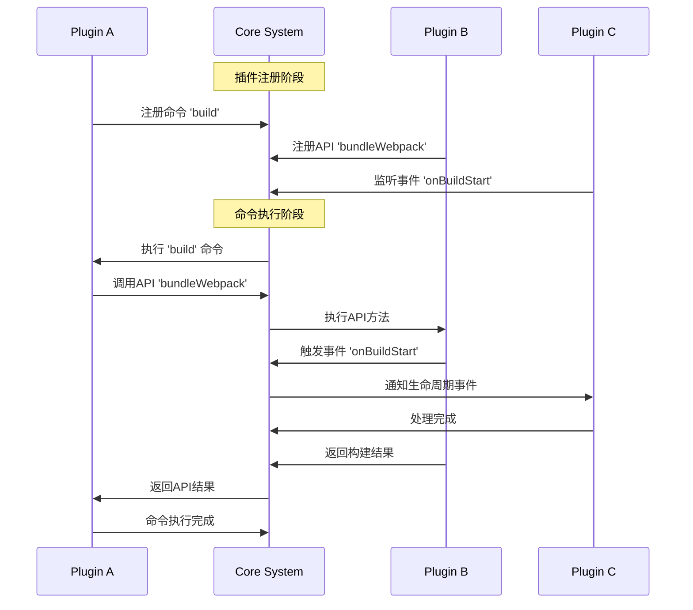

## 数据流架构图

### 1. 配置数据流

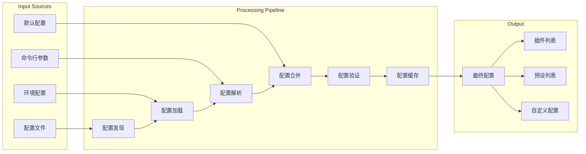

### 2. 命令执行数据流

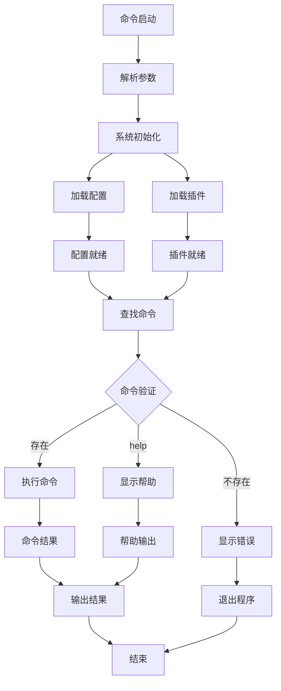

## 性能和扩展性架构

### 1. 性能优化架构

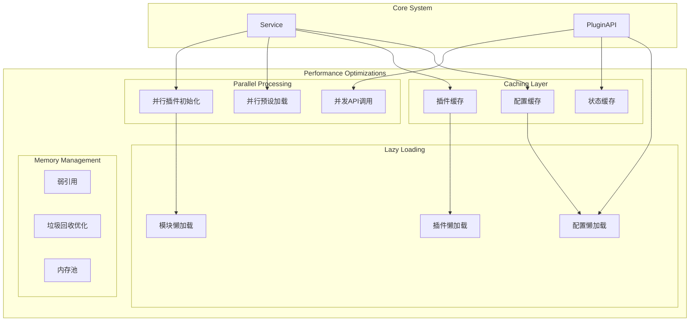

### 2. 扩展性架构

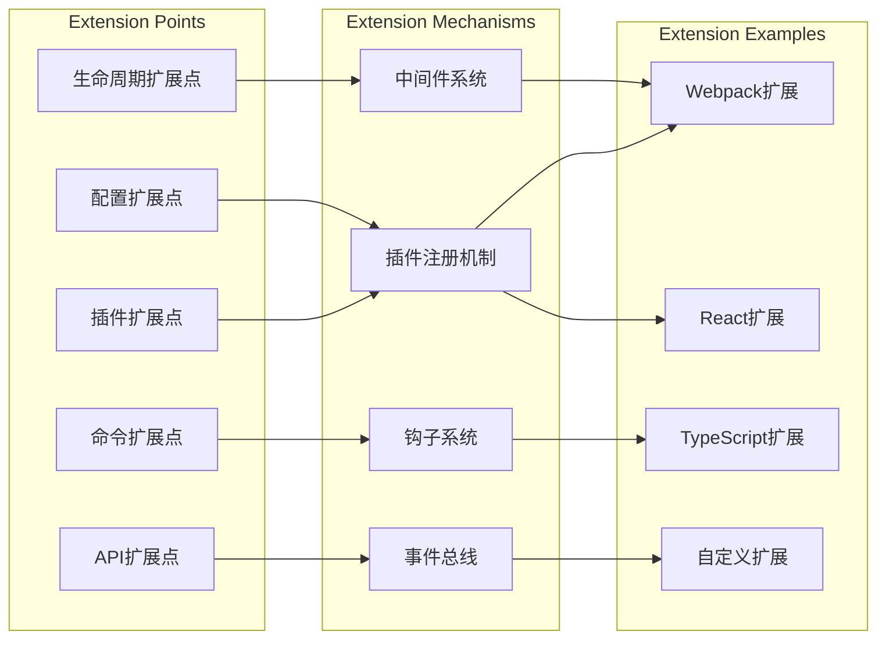

## 安全架构图

### 1. 安全边界和控制

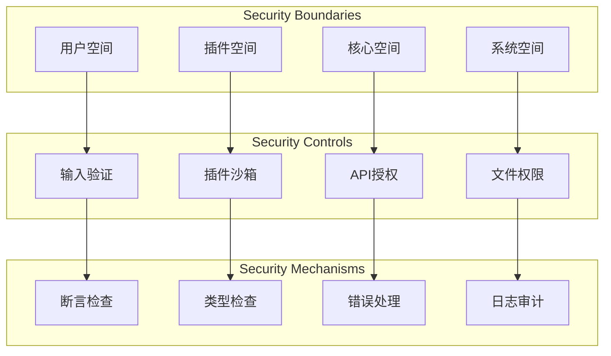

### 2. 错误处理和恢复架构

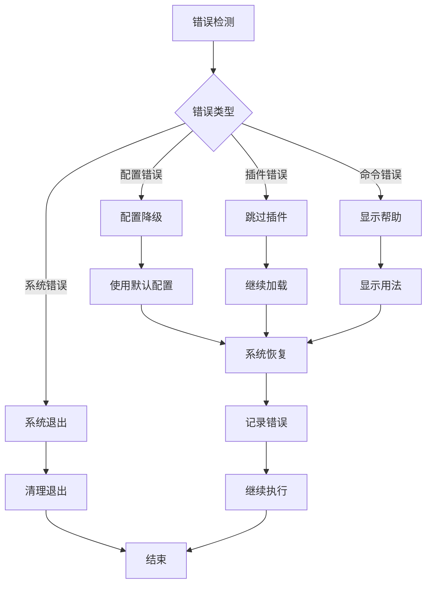

## 部署和运行时架构

### 1. 包结构和分发架构

```mermaid
graph TB
    subgraph "Package Structure"
        CORE_PKG[@alicloud/console-toolkit-core]
        
        subgraph "Source Code"
            SRC_INDEX[src/index.ts]
            SRC_SERVICE[src/Service.ts]
            SRC_API[src/PluginAPI.ts]
            SRC_TYPES[src/types/]
            SRC_UTILS[src/utils/]
            SRC_PLUGINS[src/plugins/]
        end
        
        subgraph "Built Code"
            LIB_INDEX[lib/index.js]
            LIB_SERVICE[lib/Service.js]
            LIB_API[lib/PluginAPI.js]
            LIB_TYPES[lib/types/]
            LIB_UTILS[lib/utils/]
            LIB_PLUGINS[lib/plugins/]
        end
        
        subgraph "Type Definitions"
            DTS_INDEX[lib/index.d.ts]
            DTS_SERVICE[lib/Service.d.ts]
            DTS_API[lib/PluginAPI.d.ts]
        end
    end
    
    CORE_PKG --> SRC_INDEX
    SRC_INDEX --> SRC_SERVICE
    SRC_INDEX --> SRC_API
    SRC_SERVICE --> SRC_TYPES
    SRC_SERVICE --> SRC_UTILS
    SRC_SERVICE --> SRC_PLUGINS
    
    SRC_INDEX --> LIB_INDEX
    SRC_SERVICE --> LIB_SERVICE
    SRC_API --> LIB_API
    
    LIB_INDEX --> DTS_INDEX
    LIB_SERVICE --> DTS_SERVICE
    LIB_API --> DTS_API
```

### 2. 运行时环境架构

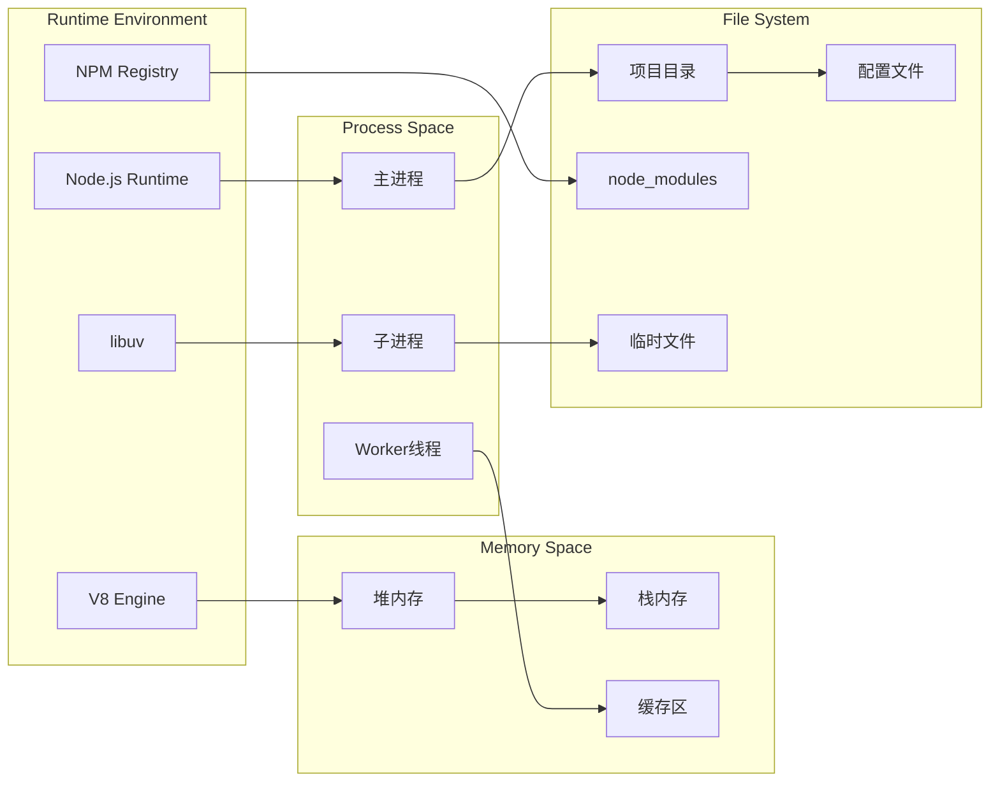

## 总结

通过全面的架构图和可视化分析，我们可以清晰地理解 `@alicloud/console-toolkit-core` 的：

### 架构特点
1. **模块化设计**：清晰的模块边界和职责分离
2. **插件化架构**：高度可扩展的插件系统
3. **分层架构**：标准的分层设计模式
4. **事件驱动**：基于事件的松耦合通信

### 设计优势
1. **可维护性**：模块化和类型安全的设计
2. **可扩展性**：灵活的插件和预设系统
3. **可测试性**：清晰的依赖关系和接口设计
4. **性能优化**：缓存、懒加载和并行处理

### 技术亮点
1. **TypeScript支持**：完整的类型定义和检查
2. **错误处理**：全面的错误处理和恢复机制
3. **配置管理**：多层次、多环境的配置系统
4. **生命周期管理**：完整的插件生命周期控制

这种架构设计为构建现代化的前端工具链提供了坚实的基础，具有良好的可维护性、可扩展性和用户体验。