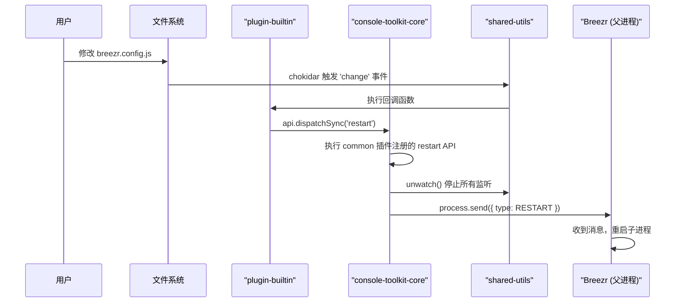
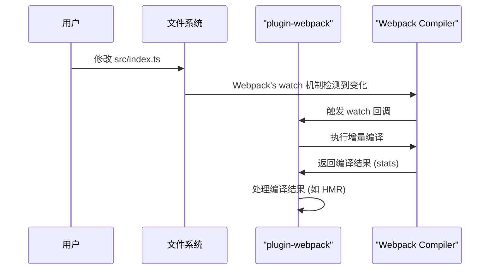

# Watch 与 Restart 机制分析

## 概述

`@alicloud/console-toolkit-core` 的 `build watch` 能力并非由单一模块实现，而是通过 `core`、`shared-utils` 和各类插件协作完成。系统提供了两种主要的 `watch` 模式：

1.  **进程级重启 (Process Restart)**: 主要用于监听配置文件的变化。当核心配置发生改变时，整个 `breezr` 进程会重启，以确保所有插件和服务都加载最新的配置。
2.  **增量构建 (Incremental Build)**: 主要由构建插件（如 `webpack`）实现，用于监听源代码的变化。当代码文件被修改时，只重新编译发生变化的部分，通常会配合热更新（HMR）使用，无需重启整个进程。

## 核心组件与数据流

### 1. 底层能力 (`@alicloud/console-toolkit-shared-utils`)

`watch` 功能的基石由 `shared-utils` 包提供，它封装了 `chokidar` 库，提供了通用的文件监听函数。

**`packages/shared-utils/src/watch.ts`**
```typescript
import chokidar from 'chokidar';

const watchers: {
  [key: string]: chokidar.FSWatcher;
} = {};

export function watch(key: string, files: string) {
  if (!watchers[key]) {
    // ...
  }
  const watcher = chokidar.watch(files, {
    ignoreInitial: true,
  });
  watchers[key] = watcher;
  return watcher;
}

export function unwatch(key?: string) {
  if (!key) {
    // unwatch all
    Object.keys(watchers).forEach(unwatch);
    return;
  }
  if (watchers[key]) {
    watchers[key].close();
    delete watchers[key];
  }
}
```

### 2. 核心 API (`@alicloud/console-toolkit-core`)

`core` 包中的 `common` 插件，利用 `shared-utils` 的能力，并结合进程间通信（IPC），定义了 `restart` API。

**`packages/core/src/plugins/common/index.ts`**
```typescript
import { unwatch, RESTART } from "@alicloud/console-toolkit-shared-utils";
import { PluginAPI } from "../../PluginAPI";

export default (api: PluginAPI) => {
  api.registerSyncAPI('restart', () => {
    // 1. 停止所有文件监听
    unwatch(); 
    // 2. 通过 IPC 通知父进程执行重启
    if (process.send) {
      process.send({ type: RESTART });
    }
  });
};
```

### 3. 插件实现

#### 进程级重启：`plugin-builtin`

`plugin-builtin` 是连接文件变化与进程重启的关键。它在 `dev` 命令执行时，监听配置文件的变化。

**`packages/plugin-builtin/src/dev.ts`**
```typescript
import { watch } from '@alicloud/console-toolkit-shared-utils';

// ...
if (absConfigPath && !getEnv().isLocalBuild()) {
  watch('config', absConfigPath).on('change', () => {
    // 当配置文件变化时，调用 restart API
    api.dispatchSync('restart');
  });
}
```

#### 增量构建：`plugin-webpack`

像 `webpack` 这样的构建插件，则使用其自身的 `watch` 模式来实现更高效的源码监听和增量构建。

**`packages/plugin-webpack/src/webpackUtils.ts`**
```typescript
// ...
    if (watch) {
      compiler.watch(
        {
          // webpack watch options
        },
        (err, stats) => {
          // handle build results
        },
      );
    }
// ...
```

## 可视化流程分析

### 1. 配置文件变更 -> 进程重启流程



### 2. 源码变更 -> 增量构建流程



## 总结

`@alicloud/console-toolkit` 的 `watch` 机制是一个分层且职责清晰的设计：

- **`shared-utils`** 提供底层的、通用的文件监听能力。
- **`core`** 提供进程级的 `restart` 抽象能力，但不关心触发时机。
- **`plugin-builtin`** 负责监听**配置文件**的变化，并触发**进程重启**，保证配置的全局生效。
- **构建插件 (如 `webpack`)** 负责监听**源代码**的变化，并触发**增量构建**，以获得最佳的开发效率。

这种设计将通用的能力下沉，将具体的业务逻辑（如何响应变化）保留在插件中，体现了良好的分层和扩展性。
