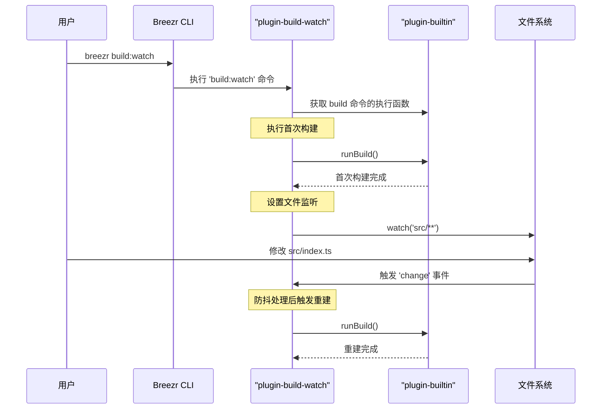

好的，这是一个非常实际的需求。基于我对 `console-toolkit` 架构的分析，实现 `build:watch` 命令的最佳方式是创建一个新的、专门的插件。

这样做的好处是：
*   **模块化**：将 `watch` 逻辑与核心的 `build` 逻辑解耦。
*   **可复用**：其他项目可以通过引入这个插件，轻松获得 `watch` 功能。
*   **符合架构设计**：完全遵循 `console-toolkit` 的插件化设计理念。

下面是为您生成的详细方案。

---

### 方案：通过新插件 `plugin-build-watch` 实现 `build:watch` 命令

#### 总体思路

我们将创建一个名为 `plugin-build-watch` 的新插件。这个插件会注册一个新的 `build:watch` 命令。当执行此命令时，它会首先执行一次标准的 `build` 流程，然后启动一个文件监听器（watcher）。当监听到源码文件发生变化时，它会再次触发 `build` 流程。

#### 实现步骤

**1. 创建新插件 `plugin-build-watch`**

首先，在 `packages/` 目录下创建一个新的插件包：

```
packages/
└── plugin-build-watch/
    ├── src/
    │   └── index.ts
    └── package.json
```

**2. 注册 `build:watch` 命令**

在 `packages/plugin-build-watch/src/index.ts` 文件中，我们将注册新命令。

```typescript
import { PluginAPI } from '@alicloud/console-toolkit-core';
import { watch } from '@alicloud/console-toolkit-shared-utils';
import { debounce } from 'lodash';

export default (api: PluginAPI) => {
  api.registerCommand('build:watch', {
    description: 'Build project and watch for changes',
    usage: 'breezr build:watch [options]',
  }, async (args) => {
    // 命令的具体实现将在这里
  });
};
```

**3. 实现命令核心逻辑**

这是方案的关键部分，我们将分三步实现：

**A. 执行首次构建**

我们不能简单地重启进程，而是需要复用 `plugin-builtin` 已经注册的 `build` 命令的执行逻辑。我们可以通过 `api.service.commands` 直接获取到 `build` 命令的执行函数并调用它。

**B. 监听文件变更**

使用从 `@alicloud/console-toolkit-shared-utils` 导入的 `watch` 函数来监听源码目录（通常是 `src`）。

**C. 触发增量构建**

当文件发生变化时，为了防止短时间内多次触发构建（例如，IDE 保存多个文件），我们会使用 `lodash.debounce` 来做防抖处理，然后再次调用 `build` 命令的执行函数。

#### 完整代码实现

这是 `packages/plugin-build-watch/src/index.ts` 的完整建议代码：

```typescript
import { PluginAPI } from '@alicloud/console-toolkit-core';
import { watch } from '@alicloud/console-toolkit-shared-utils';
import { debounce } from 'lodash';
import chalk from 'chalk';

export default (api: PluginAPI) => {
  api.registerCommand('build:watch', {
    description: 'Build project and watch for changes to rebuild automatically',
    usage: 'breezr build:watch [options]',
  }, async (args) => {
    
    // 1. 查找现有的 build 命令
    const buildCommand = api.service.commands['build'];
    if (!buildCommand) {
      console.error(chalk.red('Error: The `build` command is not available. Make sure `plugin-builtin` is loaded.'));
      return;
    }

    // 提取 build 命令的执行函数
    const runBuild = buildCommand.fn;

    try {
      // 2. 执行首次构建
      console.log(chalk.cyan('Performing initial build...'));
      await runBuild(args);
      console.log(chalk.green('Initial build completed successfully.'));
    } catch (err) {
      console.error(chalk.red('Initial build failed:'), err);
      // 首次构建失败时，可以选择是否继续监听
    }

    // 3. 设置文件监听
    const watchPath = api.resolve('src'); // 默认监听 src 目录
    console.log(`\n${chalk.cyan(`Watching for file changes in: ${watchPath}`)}`);

    const debouncedBuild = debounce(async () => {
      console.log(chalk.cyan('\nFile change detected. Rebuilding...'));
      try {
        await runBuild(args);
        console.log(chalk.green('Rebuild completed successfully.'));
        console.log(`\n${chalk.cyan(`Watching for file changes in: ${watchPath}`)}`);
      } catch (err) {
        console.error(chalk.red('Rebuild failed:'), err);
      }
    }, 500); // 500ms 防抖

    const watcher = watch('build:watch', watchPath);
    watcher.on('all', (event, path) => {
      console.log(`[watch] Event '${event}' detected on: ${path}`);
      debouncedBuild();
    });

    // 保持进程运行
    return new Promise(() => {});
  });
};
```

**4. 如何使用**

要启用这个新命令，用户只需在他们的 `breezr.config.js` 配置文件中添加这个新插件即可：

```javascript
module.exports = {
  plugins: [
    // ... 其他插件
    './packages/plugin-build-watch' // 假设在 monorepo 中本地引用
    // 或者 '@alicloud/console-toolkit-plugin-build-watch' (发布后)
  ]
};
```

#### 可视化流程



---

这个方案提供了一个完整、健壮且符合 `console-toolkit` 设计哲学的 `build:watch` 实现。
